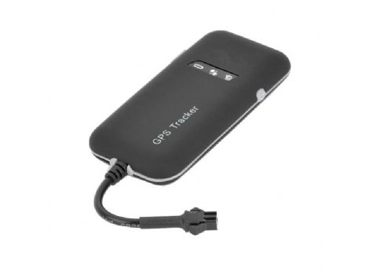

# EV - EV-100

The EV EV-100 is a compact GPS tracker designed for vehicles and motorcycles. Built with weatherproof and dust resistant construction, it offers stable performance for everyday road use. The device supports a wide operating voltage range and uses internal antennas for a lower profile and simpler servicing. It includes motion detection via a 3-axis accelerometer, on device storage for waypoint data, alarm functions, and a backup battery for continued operation if vehicle power is interrupted.

As a Plaspy compatible device, the EV-100 can feed location, movement, and alarm information into the Plaspy fleet management platform for real time visibility and historical review. Its standard vehicle tracking features and remote control options make it suitable for both fleet operators and individual vehicle owners who want to consolidate tracking, alerts, and reporting inside Plaspy for operational oversight.

## Key Highlights

- Weatherproof and dust resistant housing for reliable road use
- Wide operating voltage range for compatibility with many vehicle types
- Internal antennas for a compact, service friendly profile
- 3-axis accelerometer to support motion detection and power saving modes
- Built in waypoint storage with data reupload after blind area coverage
- Multiple alarm features including overspeed, power lost, and low power
- Remote engine and oil cut off capability for added security options

## How It Works with Plaspy

The EV-100 integrates with Plaspy to provide continuous location updates and event reporting, enabling consolidated fleet monitoring and alarm handling from the Plaspy platform. When paired with Plaspy, the tracker improves operational awareness and helps teams act on alerts and historical routes.

- Send live position updates to Plaspy for real time fleet visibility
- Generate and forward alarms such as overspeed, power loss, and low battery into Plaspy workflows
- Use stored waypoint and blind area reupload features to maintain route continuity in Plaspy reports and playback
- Control remote actions noted by the tracker through Plaspy alerts and administrative interfaces
- Include EV-100 data in Plaspy dashboards and scheduled reports for operational analysis

## Typical Use Cases

- Fleet vehicle tracking for route oversight and driver management
- Motorcycle tracking for theft deterrence and recovery assistance
- Rental vehicle monitoring and condition alerts
- Security and asset protection where remote engine disablement is useful
- Small to medium fleets that need economical, durable trackers

## Why Choose This Tracker with Plaspy

The EV-100 is a practical choice when organizations need a durable, vehicle focused tracker that covers a variety of use scenarios. Its wide voltage range and rugged construction make it suitable across different vehicle types, while internal antennas and built in storage simplify maintenance and data continuity. Combined with Plaspy, the EV-100 adds reliable location and event data into a platform designed for fleet visibility, alert management, and reporting.

Plaspy is a natural host for EV-100 data when teams need consolidated monitoring and operational controls. If you require a straightforward tracker that supports common vehicle tracking needs and integrates into a broader fleet management system, the EV-100 and Plaspy pairing is worth evaluating.

Learn more about Plaspy on the main website https://www.plaspy.com. Product specifications, availability, and manufacturer details can change over time; please verify current specifications and documentation with the manufacturer at http://www.eviewltd.com/.
