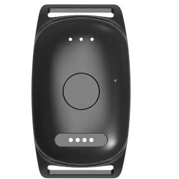

# EV - EV-201M

The EV-201M is a compact 4G LTE-M/NB GPS tracker engineered for dependable pet tracking and activity monitoring. Plaspy compatible out of the box, this GPS tracker pairs rugged IP67 waterproofing with an energy-efficient 800 mAh battery and advanced IoT power-saving modes to deliver reliable real-time tracking and location history for dogs and other domestic animals.

The EV-201M supports live tracking updates \(as frequently as every 10 seconds outdoors when Live Tracking is enabled\), manual single-location requests from a dedicated button, Bluetooth-based home beacon detection, and a comprehensive activity timeline via its mobile integration. For pet owners who want Plaspy compatible devices that deliver location, telemetry, and event alerts, the EV-201M combines durable hardware with easy cloud integration and practical pet-focused features.

## Key Highlights

- Plaspy compatible GPS tracker: integrates location and telemetry to Plaspy for centralized real-time tracking and alerts.
- Robust outdoor use: IP67 waterproof rating for reliable performance in wet or dirty conditions.
- Long battery life: 800 mAh battery with optimized IoT power-saving modes delivering approximately 5–7 days standby with proper configuration and battery learning.
- Fast live tracking: outdoor position updates as often as every 10 seconds when Live Tracking is enabled for near real-time visibility.
- Manual location request: dedicated button for single-location requests when immediate position is needed.
- Activity monitoring and timeline: track daily activity levels and review consecutive location history on a map.
- Bluetooth sensors and home beacon: BLE assists with device status, battery management, and smart home detection when a pet returns.

## How It Works with Plaspy

When used as a Plaspy compatible tracker, the EV-201M forwards GNSS positions and device telemetry over LTE-M/NB to Plaspy’s cloud platform where locations, alerts, and history are displayed on a unified map and dashboard. Plaspy can surface the EV-201M’s live tracking feed, geo-fence events and battery/telemetry alerts so you can monitor pets alongside other assets in a single interface.

- Real-time location and telemetry updates: periodic GPS fixes and device status streamed to Plaspy for live tracking.
- Live Tracking and manual position requests: supports frequent updates \(as frequently as every 10 seconds outdoors\) and single-location queries via the device button.
- Geo-fence and alerts: receive safe-zone exit/entry notifications and no-motion or low-battery alarms through Plaspy.
- Bluetooth sensors and home beacon: BLE-assisted home detection and improved battery management information available to Plaspy.
- Activity timeline and history: consecutive location history can be reviewed on Plaspy maps for route analysis and pet activity insights.

## Technical Overview

| Model | EV-201M |
| --- | --- |
| Connectivity | 4G LTE-M / NB-IoT |
| Bands | Region-dependent LTE-M / NB-IoT bands \(specific bands vary by model/region\) |
| Power & Battery | 800 mAh battery; approximate standby 5–7 days with proper configuration and battery learning |
| Interfaces | Dedicated manual location button, LED status indicator, USB charging |
| GNSS | GPS positioning for outdoor tracking |
| Bluetooth | BLE for sensors, beacons, and device status management |
| Mobile App Integration | KatchU mobile app for notifications, geo-fence alerts, activity profiles, and timeline \(iOS and Android\) |
| Durability & Form Factor | Compact pet-use design, IP67 waterproof – includes leash, USB charging cable, charger, and quick start guide |

## Use Cases

- Pet recovery and anti-theft: immediate alerts and live tracking to locate a lost or stolen pet quickly.
- Roaming territory monitoring: review daily routes and location history to understand a pet’s typical range.
- Safe-zone management: geo-fence alerts notify owners when a pet leaves a predefined area.
- Activity and health insights: activity monitoring and timeline help track exercise and identify changes in movement patterns.
- Home detection via BLE beacon: automatic “home” status when the pet enters a configured beacon area to reduce false alerts.

## Why Choose This Tracker with Plaspy

The EV-201M provides pet owners a rugged, energy-efficient GPS tracker that is Plaspy compatible for centralized monitoring. Its IP67 enclosure and BLE-enhanced power management make it a practical choice for outdoor use, while the 800 mAh battery and IoT power-saving modes extend operational life between charges. With live tracking down to 10-second intervals outdoors, manual location requests, and a clear activity timeline, the EV-201M delivers actionable telemetry and location data that Plaspy can use to generate alerts, reports, and history — all from a single dashboard.

Note: the EV-201M is optimized for pet tracking and activity monitoring. It provides telemetry such as battery and movement status and supports Bluetooth sensors, but it does not include vehicle-specific interfaces like ignition inputs, immobilizer controls, or fuel monitoring. For mixed-device deployments or fleet management scenarios, Plaspy can manage EV-201M trackers alongside other asset or vehicle trackers to provide a consolidated view of location and telemetry across use cases.

