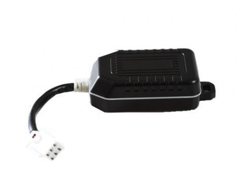

# EV - EV-603

The EV-603 is a vehicle and motorcycle GPS tracker designed for reliable location monitoring and basic fleet security features. Built to withstand harsh conditions with an IP66 rating, the unit integrates internal positioning and communication antennas along with a U-Blox GPS module to provide consistent location data. It also includes a 3D G-sensor for motion detection, on board memory for data logging, and a backup battery to maintain operation if external power is lost.

As a device compatible with Plaspy, the EV-603 can feed location, motion and event data into the Plaspy platform for centralized monitoring and reporting. The tracker’s feature set — including geofence management, over-speed notifications, SOS input and remote cut-off outputs — makes it a practical option for operators who want vehicle level visibility and control inside Plaspy for daily fleet oversight and incident handling.

## Key Highlights

- Rugged IP66 enclosure suitable for outdoor vehicle and motorcycle use  
- Internal GPS and GSM antennas paired with U-Blox positioning for reliable fixes  
- Built in 3D G-sensor for motion detection and power management alerts  
- Support for geofence, over speed alarm, low power alarm and car power lost alarm  
- Inputs and outputs for SOS panic, ACC state, door status and remote engine or oil cut off  
- Onboard flash memory with capacity for extended data logging and a backup battery for continued operation  
- Magnet mounting option for quick attachment to metal surfaces

## How It Works with Plaspy

When connected to Plaspy, the EV-603 transmits position and event records to the platform where they appear alongside other fleet assets for unified oversight. Plaspy ingests the device events and makes them available through mapping, alerts, and reporting tools so teams can act on live and historical information.

- Real time location tracking visible on Plaspy maps for vehicle and motorcycle assets  
- Event alerts such as geofence entry or exit, overspeed, SOS and power loss routed through Plaspy notification channels  
- Historical route replay and stored location logs accessible for incident review and compliance reporting  
- Remote control events recorded and displayed in Plaspy activity logs for operational auditing  
- Fleet level dashboards and reports that include EV-603 devices for performance and utilization analysis

## Typical Use Cases

- Monitoring company cars and motorcycles used for deliveries or field service teams  
- Theft recovery and tamper alerts for high value or at risk vehicles  
- Enforcing speed and geofence policies for driver safety and route compliance  
- Recording trip history for billing, route optimization and customer service follow up  
- Quick deployment on temporary or shared vehicles using magnetic mounting

## Why Choose This Tracker with Plaspy

The EV-603 is a practical choice for organizations that need a durable, straightforward tracker to feed vehicle and motorcycle data into a centralized fleet platform. Its combination of motion detection, event inputs, local logging and a backup battery supports continuous tracking and basic remote control functions that many operations require. Paired with Plaspy, the EV-603 helps turn device events into usable insights for dispatchers, fleet managers and maintenance teams.

Because the EV-603 focuses on core tracking and event features, it is well suited to fleets that prefer a dependable hardware baseline combined with a flexible cloud platform. Plaspy users benefit from quick visibility of alarms, geofence activity and historical tracks without needing to manage device level detail on every asset.

To learn more about managing EV-603 devices with Plaspy visit https://www.plaspy.com. Product specifications and availability can change over time, so please verify current details with the manufacturer at http://www.eviewltd.com/ for the most up to date information.
