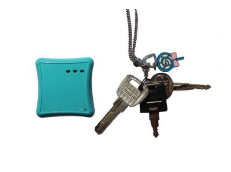

# EV - EV-606

The EV EV-606 is a versatile personal and asset tracking system that offers real-time tracking capabilities using both GPS satellite and CellLocate technology. This allows users to track their assets or loved ones even in shielded environments such as indoors or enclosed parking houses. With a long battery working time and a rechargeable and replaceable battery, you can rely on the EV-606 for extended periods of tracking without worrying about power.

One of the standout features of the EV-606 is its built-in 3D G-sensor, which provides motion, shock alarm, and power management functionalities. This ensures that you are notified of any unexpected movements or shocks to your tracked asset. Additionally, the device supports voice wiretapping and two-way voice communication, allowing for easy communication with the tracker or the person carrying it. The EV-606 also comes with 8MB of built-in flash memory and supports data logging of up to 60,000 locations, ensuring that you have access to detailed tracking information.

Other notable features of the EV-606 include free real-time online tracking, GPRS blind area data re-upload function, firmware upgrade over the air, auto tracking by time interval, SOS emergency button, geo-fencing alarm, over-speed alarm, GPS signal lost and recovery alert, movement alarm, and a mini USB port for easy connectivity. With its comprehensive set of features and reliable performance, the EV EV-606 is an excellent choice for personal and asset tracking needs.

### Technical Specifications:

- Hardware Version: EV06

