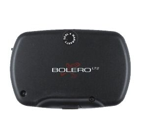

# Falcom - BOLERO-LT2

The Falcom BOLERO-LT2 is a versatile GPS tracker designed for a wide range of applications, from real-time navigation and positioning to remote tracking and monitoring. It features a quad-band GSM/GPRS engine that works on frequencies GSM 850/900/1800/1900 MHz, ensuring reliable communication in various regions. The device also incorporates a high-sensitivity GPS core based on µ-blox engine, providing accurate and precise location information.

One of the key advantages of the BOLERO-LT2 is its ease of integration into different systems. It can be seamlessly integrated into AVL \(Automatic Vehicle Location\) systems, fleet management solutions, vehicle security and recovery systems, and other related applications. The device is designed for indoor use and is ideal for fixed installations.

The BOLERO-LT2 offers a range of features to enhance tracking and monitoring capabilities. It supports configurable alert messaging, allowing users to receive real-time position updates and status reports. The device also provides geofencing functionality, enabling territory management, route verification, and monitoring of prohibited locations. With its data-logger feature, the BOLERO-LT2 can store unique locations for up to 45 days, allowing for later analysis and evaluation.

Overall, the Falcom BOLERO-LT2 is a reliable and flexible GPS tracker that offers a wide range of features for various tracking and monitoring applications. Its integration capabilities, configurable alert messaging, and geofencing functionality make it a valuable tool for fleet management, vehicle security, and other related areas.

#### Key Features:

- Quad-band GSM/GPRS engine for reliable communication
- High-sensitivity GPS core for accurate positioning
- Easy integration into AVL, fleet management, and vehicle security systems
- Configurable alert messaging for real-time updates and status reports
- Geofencing functionality for territory management and monitoring
- Data-logger for storing unique locations for up to 45 days

