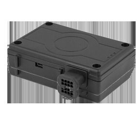

# Falcom - FOX-IN

The Falcom FOX-IN is a highly versatile and configurable smart tracking device designed to serve as a mobile client for AVL, fleet management, vehicle security, and recovery solutions. It can be customized to meet specific operational requirements and is built to operate autonomously while interacting with external sensors and actuators. The FOX-IN supports sending status reports and alert messages directly to users and tracking servers, and it includes comfort and security features such as regular voice calls, emergency spy calls, a driver's logbook, and comprehensive data logging.

As a device compatible with Plaspy, the FOX-IN can feed its location, alerts, and log records into the Plaspy platform to provide centralized visibility and operational oversight. Compatibility allows fleet managers and administrators to incorporate FOX-IN devices into Plaspy workflows for real time monitoring, geofence notification handling, historical reporting, and consolidated fleet management, making the tracker a practical choice for organizations using Plaspy for asset and vehicle tracking.

## Key Highlights

- Configurable device adaptable to a wide range of user requirements and deployment scenarios
- Designed as a mobile client for AVL, fleet management, vehicle security, and recovery
- Autonomous operation with the ability to interact with external sensors and actuators
- Direct status reports and alert messaging to users and servers via SMS and TCP
- Built in comfort and security features including voice call options and emergency call functionality
- Driver logbook and data logging for historical records and operational review
- Geofencing for monitoring predefined routes or areas and reporting violations

## How It Works with Plaspy

When used with Plaspy, the FOX-IN provides device-originated reports and alerts that the platform ingests to create a unified view of vehicle and asset activity. Plaspy organizes incoming data so teams can monitor movements, respond to incidents, and generate operational reports from a single interface.

- Map real time location updates for fleet visibility and live tracking
- Receive and manage alerts and status messages from the device inside Plaspy
- Monitor geofence entries and exits and flag route or area violations
- Consolidate driver logbook and data logging records for historical review and reporting
- Use device data within Plaspy reporting and dashboard tools for operational oversight

## Typical Use Cases

- Fleet vehicle tracking and routing oversight for commercial operators
- Vehicle security and recovery monitoring with alert and call features
- Route compliance and geofence enforcement for logistics and field services
- Driver activity logging and historical record keeping for audits and analysis
- Cost conscious asset tracking for small to medium fleets seeking flexible configuration

## Why Choose This Tracker with Plaspy

The FOX-IN is a good fit for organizations that need a configurable tracker capable of supporting multiple use cases from fleet management to vehicle security. Its autonomous operation, logging features, and geofencing capabilities make it practical for teams that require both live visibility and historical records. When connected to Plaspy, the device's status reports and alerts become part of a broader management environment that helps simplify monitoring and reporting across a fleet.

To learn more about how Plaspy works with devices like the Falcom FOX-IN visit https://www.plaspy.com. Product specifications and availability can change over time, so verify current device details and technical documentation with the manufacturer at https://www.falcom.de.
