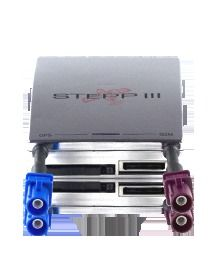

# Falcom - STEPPIII-UX

The Falcom STEPPIII-UX is a versatile and customizable smart tracking device designed as a mobile client for AVL, fleet management, vehicle security, and recovery. It is built to operate autonomously while interacting with external inputs and actors to support a wide range of tracking and monitoring scenarios. The device supports status reporting and alerts by common messaging paths and includes features such as voice and emergency call options, a driver's logbook, and integrated data logging for historical review.

As a Plaspy compatible device, the STEPPIII-UX can be incorporated into fleet and asset management workflows to provide improved operational visibility and incident awareness. Its adaptable configuration and ability to exchange status and alert information make it a practical option for organizations that want to bring Falcom device data into Plaspy for consolidated monitoring, notification, and reporting across mixed fleets.

## Key Highlights

- Highly adaptable smart tracking device suited to AVL and fleet management environments
- Designed for autonomous operation and interaction with external inputs and actors
- Flexible messaging for status reports and alerts including SMS and TCP based options
- Built in features for voice calls and emergency call functionality
- Driver logbook and data logging for historical tracking and audit
- Geofencing support for area and route monitoring with violation notifications
- Practical choice for vehicle security and recovery workflows

## How It Works with Plaspy

When paired with Plaspy, data from the STEPPIII-UX can be routed into the platform to enhance fleet visibility and operational oversight. Plaspy can present device location and event information alongside other fleet data so teams can monitor activity, respond to incidents, and generate reports from a single place.

- Location and status updates available to Plaspy for map based monitoring and real time oversight
- Geofence events forwarded to Plaspy for boundary alerts and automated notifications
- Logged history and driver logbook entries accessible for reporting and compliance review
- Alert messages and status reports mapped into Plaspy workflows for incident handling
- Use of device messaging options to integrate device events with Plaspy notification channels

## Typical Use Cases

- Fleet tracking and route monitoring for small and midsize vehicle fleets
- Vehicle security and recovery coordination with geofence alerts and status reports
- Driver activity logging and historical review for operational and compliance needs
- Remote asset monitoring where adaptable device configuration is required
- Geofence based alerts for site access control and route adherence monitoring

## Why Choose This Tracker with Plaspy

The STEPPIII-UX is a practical fit for organizations using Plaspy when they need a configurable device that can be tailored to specific monitoring and alerting requirements. Its combination of autonomous operation, messaging flexibility, and logging features makes it suitable for integrating into Plaspy workflows that emphasize location visibility, incident notification, and historical reporting.

If you want to learn more about how Falcom devices can be used with Plaspy and whether the STEPPIII-UX fits your deployment, please visit the Plaspy website at https://www.plaspy.com. Product specifications and availability can change over time, so verify current details and compatibility on the manufacturer site https://www.falcom.de.
