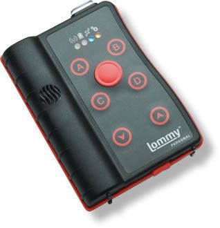

# Flextrack - Lommy Personal

The Flextrack Lommy Personal is a dedicated personal safety tracking device designed for people who need discreet, reliable location monitoring. It is described as suitable for lone workers, social workers, elderly individuals, and children, and offers a user configurable form factor to match individual needs. The Lommy Personal emphasizes long operating time between charges and a highly sensitive GPS receiver that supports tracking in difficult environments.

As a Plaspy compatible device, the Lommy Personal can be integrated into Plaspy's fleet and asset visibility platform to provide location awareness and operational oversight for organizations and families. Its extended battery options and sensitivity to challenging conditions make it a practical choice where continuous or extended monitoring is required, and Plaspy can surface its position data and status in dashboards, reports, and alerts for routine monitoring and incident response.

## Key Highlights

- Purpose built for personal safety in both professional and private settings
- Suitable for lone workers, social workers, elderly users, and children
- Configurable to match individual user needs and preferences
- Powerful battery for long operating time between charges
- Highly sensitive GPS receiver for reliable location in challenging conditions
- Available high capacity extended battery option for longer deployments

## How It Works with Plaspy

When paired with Plaspy, the Lommy Personal provides position updates and status that Plaspy uses to give teams and caregivers clear visibility into location and movement. Plaspy presents device data in a unified interface so organizations can monitor devices alongside vehicles and other assets.

- Real time location visibility on Plaspy maps and dashboards for quick situational awareness
- Historical location trails and event logs for review and reporting purposes
- Configurable alerts and notifications in Plaspy for important events and location changes
- Grouping and assignment features to organize devices by team, region, or user role
- Standardized reporting and export options to support operational reviews and compliance

## Typical Use Cases

- Lone worker monitoring for remote or field based staff
- Social worker and home visit tracking to improve safety and coordination
- Assisted living or elderly supervision where discreet location awareness is needed
- Parental monitoring for children during travel or daily activities
- Temporary staffing or event security where portable personal tracking is required

## Why Choose This Tracker with Plaspy

The Lommy Personal is a practical option for organizations and individuals who need a simple, focused personal tracking solution. Its emphasis on long operating time and a sensitive GPS receiver complements Plaspy's strengths in centralized monitoring, alerts, and reporting, making it straightforward to include personal devices alongside other tracked assets.

If you are evaluating personal safety devices for use with Plaspy, the Lommy Personal is worth considering for scenarios that prioritize ease of use, extended uptime, and reliable positioning in difficult conditions. Learn more about Plaspy on the main website https://www.plaspy.com. Product specifications, availability, and manufacturer details can change over time, so verify current specifications and options with the official manufacturer documentation at https://flextrack.dk.
