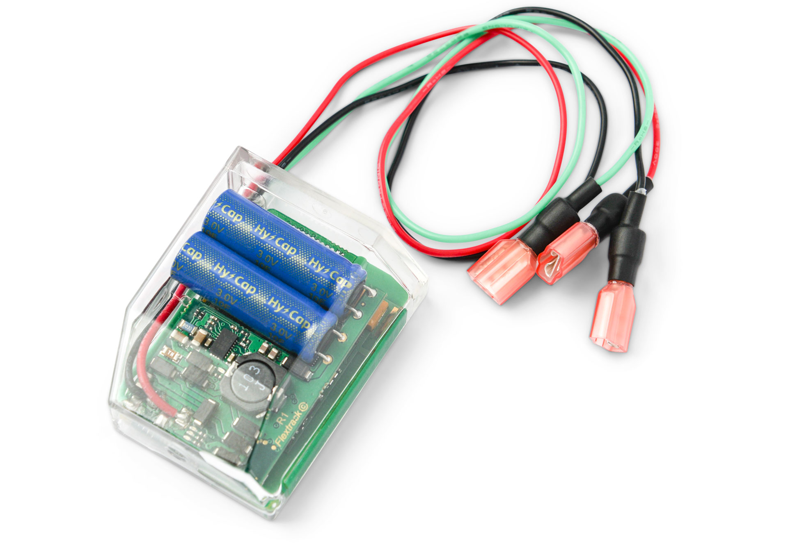

# Flextrack - Lommy Power

Lommy Power is a compact wired GPS tracker designed for continuous, real-time tracking of heavy machinery and equipment. Plaspy compatible out of the box, Lommy Power pairs rugged, IP65-rated hardware with multi-constellation GNSS and intelligent 4G + 2G communications so fleets and contractors can rely on uninterrupted telemetry and accurate position data for fleet management, anti-theft protection, and operational reporting.

Built for harsh environments in construction, agriculture, forestry and other heavy-duty applications, Lommy Power draws its power directly from the vehicle or machine battery \(5–40 V\) to ensure persistent monitoring without maintenance of an internal battery. When integrated with Plaspy, the device delivers location, motion, ignition and operating-hour data into a centralized platform for alerts, geofencing, utilization analysis, and compliance-ready reporting.

## Key Highlights

- Continuous wired power \(5–40 V\) eliminates downtime from depleted internal batteries — ideal for long-term asset tracking and fleet management.
- Compact, easy-to-hide form factor \(54 × 44 × 19 mm, 42 g\) with IP65 housing and wide temperature range for reliable field operation.
- Accurate multi-constellation GNSS \(GPS, GLONASS, GALILEO, BEIDOU, QZSS\) with SBAS support for position accuracy down to a few metres.
- Intelligent 4G LTE Cat M1 \(B3/B8/B20\) with quad-band 2G fallback and UDP/SMS protocols for robust connectivity in mixed-coverage areas.
- Power-aware reporting logic \(frequent updates when ignition/aux active; extended low-rate reporting when idle\) to balance real-time tracking and data efficiency.
- Built-in 3-axis accelerometer and motion detection for movement-triggered alerts, geofence breach detection and anti-theft workflows.
- Simple installation and integration with Flextrack platforms \(TrackEye, LommyFleet\) or third-party systems via APIs and white-label solutions.

## How It Works with Plaspy

When connected to Plaspy, Lommy Power streams GNSS and telemetry over LTE/2G to Plaspy’s ingestion endpoints using UDP or SMS. Plaspy normalizes the device data, applies configurable rules and geofences, and provides real-time visualization, alerts, and historical reports for fleet operations and anti-theft monitoring. The device’s smart reporting modes reduce unnecessary transmissions while ensuring timely updates during movement or ignition events.

- Real-time location and telemetry updates delivered to Plaspy for live maps and history playback.
- Ignition and auxiliary input detection — Plaspy receives start/stop events for utilization and maintenance scheduling.
- Operating-hours telemetry based on battery-current measurement for accurate equipment usage and invoicing reports.
- Movement-triggered reporting and geofence alerts to support anti-theft and misuse notifications.
- Plaspy can aggregate additional inputs \(fuel monitoring sensors, Bluetooth sensors from compatible devices, immobilizer workflows\) so operators get a full telemetry picture even if those sensors are provided by other hardware.

## Technical Overview

| Connectivity | 4G LTE Cat M1 \(FDD\) with quad-band 2G fallback |
| --- | --- |
| Bands | LTE Cat M1 B3 / B8 / B20; fallback to quad-band 2G \(GSM\) |
| Protocols | UDP, SMS |
| Power & Battery | Wired device powered from machine battery, operating range 5–40 V; no internal primary battery |
| Interfaces | Ignition/start-stop detection; optional auxiliary input \(third wire\); battery-current measurement for operating hours |
| GNSS | Multi-constellation: GPS, GLONASS, GALILEO, BEIDOU, QZSS; SBAS \(WAAS, EGNOS, MSAS, GAGAN\); position accuracy down to a few metres |
| Antennas | Internal GNSS and LTE/GSM antenna \(best reception when label-side and thin edge oriented outward\) |
| Memory & Sensors | 2 MB internal flash memory; 3-axis accelerometer for motion detection |
| Sensitivity & Channels | Tracking sensitivity down to -166 dBm; 33 tracking channels, 99 acquisition channels, 210 PRN channels |
| Reporting Logic | Reports every 2 minutes when ignition/aux active; reports once every 24 hours when engine off and no movement; movement while off reverts to 2-minute reporting |
| Environmental | IP65 rated; operating temperature -30 to +60 °C |
| Dimensions & Weight | 54 × 44 × 19 mm; 42 g |
| Certifications & Security | CE, \(E pending\), RoHS, WEE; server and data handling follows ISAE3402 references \(ISO 27002\) |
| Integrations | Native support for Flextrack platforms \(TrackEye, LommyFleet\); open APIs and white-label options for third-party platforms such as Plaspy |
| Bluetooth | No Bluetooth reported for this unit; Plaspy can combine Bluetooth sensor data from compatible peripheral devices when present |

## Use Cases

- Fleet and heavy-equipment management — continuous telemetry for utilization, scheduling, and invoicing based on operating hours.
- Anti-theft and misuse detection — movement alarms, geofence breaches and ignition events routed to Plaspy for rapid response.
- Construction, agriculture and forestry machinery monitoring — ruggedized design and wide temperature range for harsh sites.
- Maintenance planning and uptime optimization — accurate start/stop and operating-hour data to plan service intervals and reduce downtime.
- Complementary telemetry solutions — combine Lommy Power data with fuel monitoring sensors or Bluetooth sensors in Plaspy for fuller asset visibility.

## Why Choose This Tracker with Plaspy

Lommy Power offers a practical balance of rugged hardware, continuous wired operation and multi-constellation positioning that matches the demands of fleet management and heavy-equipment monitoring. When integrated with Plaspy, operators gain reliable real-time tracking, telemetry-driven insights and configurable anti-theft workflows without frequent battery service. The device’s intelligent reporting minimizes data use while ensuring critical events are reported promptly, and open APIs plus native Flextrack integrations make deployment and scaling straightforward. Choose Lommy Power with Plaspy for dependable GPS tracking, clear operating-hour reporting, and a secure, standards-aligned data handling approach that supports fleet efficiency and theft protection.

