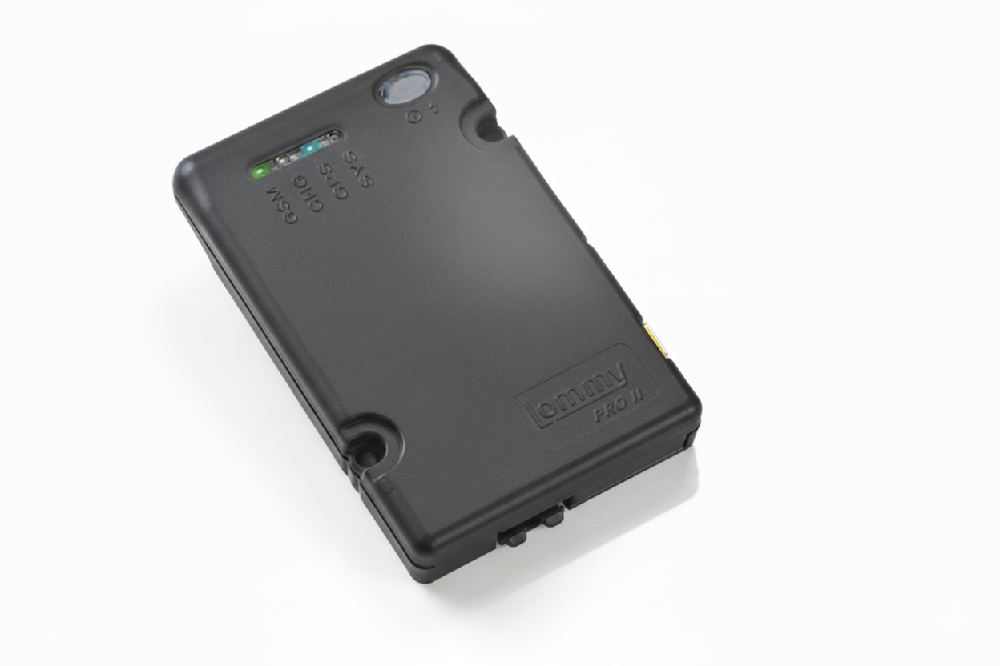

# Flextrack - Lommy Pro T

Lommy Pro T is a Plaspy compatible temperature-monitoring and GPS tracker built for high-value, temperature-sensitive shipments. Designed for continuous cold-chain oversight, Lommy Pro T combines high-precision temperature telemetry with reliable GPS positioning and GSM triangulation so operators can both verify storage conditions and locate assets in transit. Its wide measurement range and continuous logging make it especially suited to medicines, vaccines and other regulated goods where proof of correct handling is mandatory.

As a Plaspy compatible device, Lommy Pro T streams real-time tracking and environmental telemetry into monitoring platforms via open APIs. This allows fleet management teams and cold-chain operators to receive instant alarms, maintain 24/7 documentation, and trigger corrective actions from a central console. Whether deployed as a stand-alone logger or integrated into refrigerated units, Lommy Pro T supports uninterrupted operation through a combined internal battery and external power approach.

## Key Highlights

- Plaspy compatible: easy integration via open API for real-time tracking, geofencing, alerts and historical reporting.
- Wide temperature range: precise monitoring from −200°C to +300°C for extreme cold-chain environments.
- Continuous data logging: 24/7 documentation and secure records for regulatory compliance and forensic analysis.
- Dual-location capability: GPS positioning plus GSM triangulation for recovery and anti-theft support.
- Flexible power options: internal battery with the ability to leverage cooling-unit power for uninterrupted operation.
- Immediate alarm notifications: automatic alerts when configured temperature thresholds are exceeded.
- Adaptable installation: suitable for refrigerated boxes, containers, freezer rooms and vaccine carriers.

## How It Works with Plaspy

Lommy Pro T is fully designed to feed Plaspy with the telemetry and location data needed for real-time tracking and cold-chain assurance. When connected, the device pushes periodic temperature readings, event-driven alarms, and location updates to Plaspy over the cellular network. Plaspy can visualize live maps, generate historical trails, trigger geofence events and archive temperature logs as certified documentation.

- Real-time location and telemetry updates: periodic GPS fixes and GSM-derived position estimates are sent to Plaspy for map visualization and route history.
- Temperature alarms and excursion reports: immediate notifications to Plaspy when readings pass configured thresholds, with attached logs for audit trails.
- Continuous logging and secure documentation: timestamped temperature records are available in Plaspy for troubleshooting and regulatory evidence.
- Remote configuration and management: change thresholds, reporting intervals and alert recipients through Plaspy’s management interface using the device API.
- Integration-friendly telemetry: temperature and location streams can augment existing fleet management data \(for example ignition or fuel monitoring feeds\) where those systems are already present.

## Technical Overview

| Model | Lommy Pro T |
| --- | --- |
| Manufacturer | Flextrack \(Lommy series\) |
| Temperature Range | −200°C to +300°C |
| Connectivity | Cellular GSM \(GSM triangulation\) for telemetry and alarms |
| Positioning | GPS positioning combined with GSM triangulation |
| Power & Battery | Internal battery with option to leverage cooling-unit power for continuous operation |
| Data Logging | 24/7 continuous logging with secure documentation for audits and forensic analysis |
| Integration / Remote Management | Open API integration with LommyFleet or customer systems; remote settings and alert management supported |
| Form Factor & Mounting | Adaptable for refrigerated boxes, containers, freezer rooms and vaccine carriers; can operate as stand-alone or integrated module |

## Use Cases

- Vaccine and pharmaceutical transport: continuous temperature monitoring and certified logging for last-mile delivery of vaccines and sensitive medicines.
- Refrigerated container and trailer monitoring: real-time alerts and geolocation for long-distance cold-chain shipments.
- Cold storage rooms and warehouses: integrated monitoring to document storage conditions and speed corrective action if excursions occur.
- Vaccine carriers and portable devices: reliable temperature oversight during outreach campaigns or clinic distribution.
- Asset protection and recovery: GPS and GSM-based positioning to support anti-theft response and locate missing cold-chain assets.

## Why Choose This Tracker with Plaspy

Choosing Lommy Pro T as a Plaspy compatible GPS tracker provides a unified solution for environmental compliance and asset visibility. Operators gain precise temperature telemetry alongside location context, enabling faster responses to excursions and clear documentation for regulators. The device’s flexible power design and adaptable form factor reduce downtime risk and simplify installation across a fleet of refrigerated boxes, containers and storage rooms.

Integration via open API lets fleet management and cold-chain teams incorporate Lommy Pro T telemetry into broader systems, enhancing fleet management dashboards with temperature data and location trails. While Lommy Pro T focuses on environmental monitoring and positioning, it is designed to complement existing vehicle signals—such as ignition, immobilizer or fuel monitoring—where those streams are already available in your fleet setup, delivering a richer telemetry picture without replacing current infrastructure.

