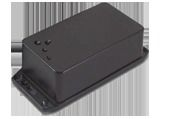

# Fortuna Impex - Disha 9330

The Fortuna Impex Disha 9330 is an intelligent vehicle tracking system built for companies in services, delivery, and transportation. It collects and analyzes asset information to help fleet managers monitor vehicle locations and utilization. The device provides both real time and historical tracking on the web, together with alerts, events, and scheduled reports via SMS and email to keep operations informed.

As a Plaspy compatible device, the Disha 9330 can feed its location and event data into Plaspy to provide centralized visibility and control. That compatibility makes it suitable for organizations that want to combine the tracker hardware capabilities with Plaspy's monitoring, reporting, and fleet oversight tools without changing their existing operational workflows.

## Key Highlights

- Real time and historical vehicle tracking accessible on the web
- Real time alerts, events, and scheduled reports delivered by SMS and email
- Designed for services, delivery, and transportation fleet monitoring
- Simple dashboard mounting and straightforward power connection for quick deployment
- GPS and GPRS antennas are enclosed to reduce external exposure and mechanical damage
- Data collection and basic analysis to support resource utilization

## How It Works with Plaspy

When used with Plaspy, the Disha 9330 supplies location and event information that Plaspy displays, records, and uses for operations and reporting. Plaspy ingests the device data to provide a single pane of glass for fleet visibility, alerting, and historical analysis.

- Live location display and real time map visibility for tracked vehicles
- Historical route playback and timeline reporting for trip review
- Configurable alerts and notifications within Plaspy based on events reported by the tracker
- Scheduled reports and summaries delivered through Plaspy using the tracker data
- Fleet dashboards and utilization views to support operational decision making

## Typical Use Cases

- Delivery fleet tracking and route monitoring for on time performance
- Field service vehicle oversight for coordination and rapid dispatch
- Transportation operations that require historical route review and reporting
- Resource utilization tracking to optimize vehicle assignments and schedules
- Scheduled reporting to stakeholders via email or SMS for routine updates

## Why Choose This Tracker with Plaspy

The Disha 9330 is a practical choice for organizations that need straightforward vehicle tracking combined with a managed software platform. Its web based tracking, alerting, and reporting features align well with Plaspy's capabilities for visibility and operational oversight, allowing teams to consolidate hardware data into Plaspy dashboards and reports.

Because the design emphasizes easy installation and protected antennas, the Disha 9330 can reduce deployment time and exposure to mechanical wear compared with solutions that require external antenna routing. When paired with Plaspy, this tracker can become part of a scalable monitoring solution for mixed fleets and routine operational needs.

To learn more about managing compatible trackers and fleet features, visit Plaspy at https://www.plaspy.com. Product specifications and availability can change over time, so for the latest manufacturer details check Fortuna Impex documentation at http://fortunaindia.com/
