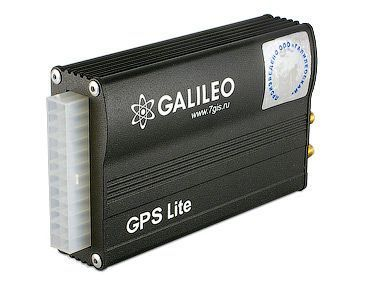

# GalileoSky - GALILEOSKY Lite v1.8.5

The GALILEOSKY Lite v1.8.5 is a vehicle GPS tracker designed to record and transmit precise geographic coordinates, time stamped points, and basic sensor information for moving vehicles. It stores detailed track data including routes and events, supports local buffering of points when communication is interrupted, and forwards collected data to a central server for dispatch processing. The device is positioned to reduce operating costs by supporting fuel economy initiatives, lowering transport mileage, and improving driver discipline while also offering an emergency alarm function for drivers.

As a Plaspy compatible device, the GALILEOSKY Lite v1.8.5 can feed its stored and live location points into the Plaspy platform for visualization, monitoring, and reporting. Plaspy can use the tracker data to provide fleet managers with route playback, alerts generated by the device, and aggregated operational insights. The combination of the tracker hardware and Plaspy software helps organizations turn raw position and event data into actionable fleet oversight and management information.

## Key Highlights

- Accurate location and route recording with time stamped points and continuous track drawings even when communication is interrupted
- Built in non volatile memory capable of storing up to 58,000 points for offline buffering and later upload
- Two versatile analog digital frequency pulse inputs for additional sensor or signal monitoring
- Built in accelerometer and thermometer to support motion filtering and basic temperature diagnosis
- EcoDrive function to support monitoring of sudden acceleration braking and road impacts for driver behavior insight
- Remote configuration, diagnostics, and firmware updates via GPRS plus support for SMS operation and a USB 2.0 interface for PC connectivity

## How It Works with Plaspy

When integrated with Plaspy, the GALILEOSKY Lite v1.8.5 becomes a source of continuous vehicle position and event data that Plaspy ingests for operational monitoring and reporting. Plaspy can present the incoming points as live location, historical tracks, and event timelines for each tracked vehicle.

- Live position visibility and location history playback for fleet monitoring and dispatch oversight
- Alerting and alarm handling inside Plaspy based on driver triggered alarms or device reported events
- Reports and dashboards that summarize EcoDrive events and movement patterns to support driver coaching and fuel economy programs
- Access to buffered data after connectivity gaps so Plaspy can reconstruct continuous tracks and detect missing segments
- Remote diagnostics and configuration workflows enabled by the device features to reduce onsite maintenance

## Typical Use Cases

- Fleet route tracking and historical route playback for logistics and delivery operations
- Driver behavior monitoring and coaching programs using EcoDrive event summaries
- Theft deterrence and recovery support through regular location reporting and alarm button events
- Remote device diagnostics and configuration for centralized device management
- Monitoring of device temperature and status indicators as part of operational health checks

## Why Choose This Tracker with Plaspy

The GALILEOSKY Lite v1.8.5 is suited to organizations that need reliable position logging with robust local memory and practical features for fleet management. Its ability to store many points locally and create continuous track drawings reduces data gaps and helps Plaspy deliver accurate route reconstructions and event timelines. Built in motion sensing and EcoDrive capabilities add useful context for driver performance and safety programs.

Paired with Plaspy, this tracker provides a straightforward way to bring vehicle location, basic sensor inputs, and event data into a single monitoring platform. The device supports remote configuration and updates which complements centralized operations and can reduce the need for onsite interventions.

To learn more about how Plaspy can use data from GALILEOSKY Lite v1.8.5 trackers, visit https://www.plaspy.com. Product specifications and availability can change over time, so please verify current technical details and documentation with the manufacturer at https://galileosky.com/ before making procurement or deployment decisions.
