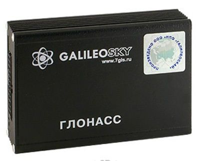

# GalileoSky - GALILEOSKY V5.0

The GALILEOSKY V5.0 from GalileoSky is a flagship GPS tracker built for reliability and versatile deployment. It is designed to support extensive external connectivity, allowing integration with up to 17 digital sensors and a range of external devices. With capabilities aimed at detailed monitoring and broad operational use, the V5.0 suits organizations that need richer visibility and control over mobile and fixed assets.

As a Plaspy compatible device, the GALILEOSKY V5.0 can be managed and monitored within Plaspy to provide centralized location tracking, event visibility, and operational oversight. Dual SIM support, configurable roaming and preferred network settings, and multiple monitoring modes make it a flexible option for fleet and asset tracking projects that use Plaspy for reporting, alerts, and day to day device management.

## Key Highlights

- Flagship GPS tracker offering high reliability and extensive functionality
- Supports connection of up to 17 digital sensors and many external devices
- Dual SIM card capability for increased connectivity and operator flexibility
- Complies with European Union quality standards
- Multiple monitoring modes including online monitoring, offline monitoring, and stealth mode
- Options for preferred network selection and custom roaming settings to help manage data costs
- Detailed drawing angles and reporting options aimed at improving tracking accuracy

## How It Works with Plaspy

When paired with Plaspy, the GALILEOSKY V5.0 feeds position and device status into a single fleet management platform so teams can monitor assets, respond to events, and generate reports. Plaspy uses the tracker data to deliver visibility and operational insights across locations and assets.

- Live location and location history visible in Plaspy for route review and diagnostics
- Sensor and external device inputs available for event triggers and alerting within Plaspy
- Monitoring modes reflected in the platform so administrators can manage visibility and discreet tracking needs
- Centralized reporting that incorporates device activity and sensor events for operational analysis
- Device connectivity and SIM status monitoring to help teams identify coverage or roaming issues

## Typical Use Cases

- Fleet vehicle tracking and route monitoring for transport and logistics operations
- Asset monitoring where multiple external sensors provide status and event data
- Testing and laboratory environments that monitor multiple devices under test
- Remote or international deployments benefiting from dual SIM flexibility and roaming controls
- Situations requiring discreet or temporary stealth monitoring as part of operational procedures

## Why Choose This Tracker with Plaspy

The GALILEOSKY V5.0 is a strong choice for organizations that need a versatile tracker capable of handling many external inputs while maintaining reliable connectivity. Its dual SIM design and configurable roaming and preferred operator settings make it practical for operations that cross different coverage areas or need backup connectivity. Combined with Plaspy, the tracker’s data can be turned into actionable visibility, alerts, and reports to support daily operations and long term analysis.

Plaspy users benefit from bringing the V5.0 into a unified management environment where location, sensor events, and monitoring modes are accessible alongside other devices. If your requirements include extensive sensor connectivity, EU quality compliance, and flexible connectivity options, the GALILEOSKY V5.0 paired with Plaspy is worth evaluating further.

Learn more about Plaspy on the main website https://www.plaspy.com. Product specifications, availability, and manufacturer details can change over time, so please verify current technical information on the GalileoSky website https://galileosky.com/.
