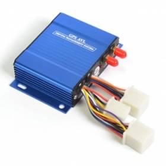

# Gator - M508

The Gator M508 GPS tracker is a versatile device designed for fleet management and security purposes. It is ideal for managing construction trucks, rental cars, logistics vehicles, and public transportation. With its advanced GPS chipsets and multi-band GSM module, the M508 offers accurate and reliable tracking capabilities.

One of the standout features of the Gator M508 is its ability to track vehicles either by SMS or GPRS. This allows for real-time monitoring of the vehicle's location and movement. Additionally, the tracker can be set to track at regular intervals or on demand, providing flexibility and control over tracking preferences.

The M508 also offers a range of alarm features to enhance security and safety. It includes an SOS alarm for emergency situations, a low power alarm to ensure the device is always operational, and a speeding alarm to monitor and prevent excessive speeds. The tracker also has a geo-fence alarm, which alerts you when the vehicle enters or exits a predefined area, and a parking alarm to notify you of any unauthorized vehicle movement.

Other notable features of the Gator M508 include voice monitoring, fatigue driving alarm, engine cut-off capability, and the ability to detect engine status, ACC, doors, and air conditioning. The tracker also has an internal Li-polymer battery for backup power, three digital inputs, and one digital output for additional functionality.

With its comprehensive range of features and reliable performance, the Gator M508 GPS tracker is an excellent choice for fleet management and security applications. Whether you need to track and monitor your vehicles or protect them from theft, the M508 offers the functionality and reliability you need.

