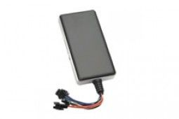

# Gator - M588S

The Gator M588S is a GPS tracking device that is designed to provide accurate and reliable location data for various applications. It consists of two main components: a GPS module and a GSM module. The GPS module is responsible for receiving location data from satellites, while the GSM module is used to transfer the data to a server, allowing users to access the information via PC or mobile phone.

This GPS tracker is particularly well-suited for vehicle tracking and fleet management. It can be used to track motorcycles, taxis, cars, buses, and trucks, providing real-time location updates and valuable insights for efficient fleet management. With its wide voltage input range of 9-36vDC, the Gator M588S can be easily installed in a variety of vehicles.

The Gator M588S offers a range of outstanding features that make it a reliable and versatile GPS tracking device. It supports quad-band GSM frequencies \(850/900/1800/1900\), ensuring global coverage and seamless communication. The built-in vibration sensor provides theft-proof functionality, triggering an alarm in case of unauthorized movement. The ACC ignition detection feature allows users to monitor the ignition status of the vehicle. Additionally, the device has a tele-cutoff function that can remotely cut off the petrol or electricity supply, adding an extra layer of security.

Other notable features of the Gator M588S include three SOS numbers for emergency situations, SOS and burglar alarms, voice monitoring capability, and an alarm for intentional power supply disconnection. The device also supports geo-fencing, allowing users to set virtual boundaries and receive alerts when the vehicle enters or exits the designated area. Mileage statistics and data re-sending from signal dead zones further enhance the functionality of this GPS tracker. Users can also receive alarm notices via SMS for added convenience and peace of mind.

