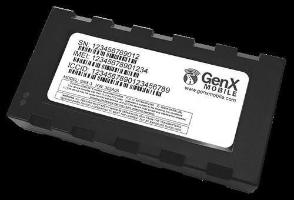

# GenX Mobile - GNX-3

The GenX Mobile GNX-3 is a versatile and advanced GPS tracker that offers a wide range of features to meet various market and industry needs. Whether you require mobile resource management or vehicle tracking, the GNX-3 is designed to deliver exceptional performance and reliability. With its cutting-edge technology and high-quality components, this tracker ensures accurate and real-time location tracking for a variety of applications and services.

One of the standout features of the GNX-3 is its highly configurable nature, allowing you to customize it according to your specific requirements. This flexibility makes it an ideal solution for businesses and organizations with diverse tracking needs. Additionally, the GNX-3 is equipped with a 3-axis accelerometer that automatically calibrates to monitor and report rapid acceleration, deceleration, harsh cornering, and other events. This feature provides valuable insights into driver behavior and vehicle performance, enabling you to optimize operations and enhance safety.

With its superior reliability and performance, the GenX Mobile GNX-3 is a top choice for those seeking a feature-rich and dependable GPS tracking solution. Whether you need to track vehicles, manage mobile resources, or monitor assets, the GNX-3 offers the functionality and versatility to meet your needs.

### Key Features:

- Highly configurable for diverse tracking requirements
- Superior reliability with high-performance internal cellular and GPS antennas
- Auto-calibrating 3-axis accelerometer for monitoring driver behavior and vehicle performance
- Real-time and accurate location tracking
- Designed for Mobile Resource Management and vehicle tracking

