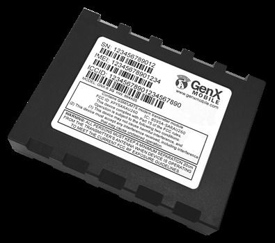

# GenX Mobile - GNX-6

The GenX Mobile GNX-6 is a versatile and advanced GPS tracker that offers a wide range of features to meet various market and industry needs. Whether you require mobile resource management or vehicle tracking, the GNX-6 is designed to deliver exceptional performance and reliability. With its cutting-edge technology and high-quality components, this tracker ensures accurate and efficient location tracking for a variety of applications and services.

One of the standout features of the GNX-6 is its highly configurable nature, allowing you to customize it according to your specific requirements. This flexibility makes it an ideal solution for businesses and organizations with diverse tracking needs. Additionally, the GNX-6 boasts a robust design, incorporating high-performance internal cellular and GPS antennas. These antennas ensure strong and reliable signal reception, even in challenging environments.

Another notable feature of the GNX-6 is its auto-calibrating 3-axis accelerometer. This accelerometer enables the tracker to monitor and report rapid acceleration, deceleration, harsh cornering, and other events. This functionality is particularly useful for applications that require monitoring driver behavior or ensuring the safety and security of valuable assets.

With its exceptional features and reliability, the GenX Mobile GNX-6 is a top choice for businesses and individuals seeking a high-performance GPS tracker. Whether you need to track vehicles, manage mobile resources, or monitor driver behavior, the GNX-6 offers the versatility and functionality to meet your needs.

