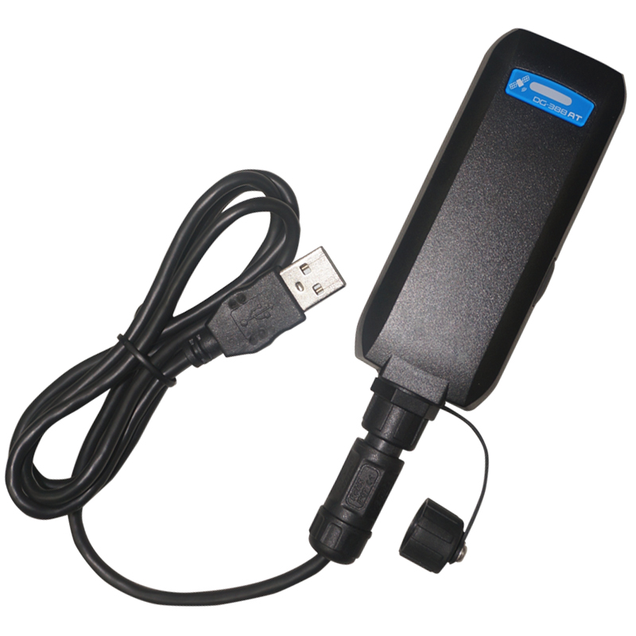

# GlobalSat - DG-388AT

The DG-388AT is a compact, Plaspy compatible GPS tracker-style data logger built for personal and light-asset tracking where reliable route history matters more than continuous cellular telemetry. Designed as a standalone GPS logger with Bluetooth Low Energy \(BLE\) connectivity, the DG-388AT records time, date, speed, altitude and GPS coordinates to create detailed route histories that can be exported and consumed by Plaspy for analysis, visualization and reporting.

Lightweight, rugged and IPX7 water-proof \(when used without external cables\), the DG-388AT balances long battery life with dense waypoint storage so you can capture long excursions without frequent downloads. Its BLE pairing and ez-Connect app support make it straightforward to retrieve logs, convert to GPX and import into Plaspy to support telemetry workflows, historical fleet or asset movement review, and personal activity logging.

## Key Highlights

- Plaspy compatible via GPX export and ez-Connect integration—easy import of recorded routes and telemetry history.
- Bluetooth Low Energy \(BLE\) pairing for simple data transfer to iOS and Android devices—no cellular subscription required.
- Massive waypoint capacity—stores up to 500,000 waypoints for long-term logging without frequent offloads.
- Long battery runtime—built-in 820 mAh rechargeable battery delivers more than 50 hours of typical logging operation.
- Rugged, water-resistant design—meets IPX7 rating \(when no external cables are attached\) for outdoor and active use.
- Flexible logging modes—time interval, distance-based and speed-based recording to match activity and telemetry needs.
- On-device POI recording and G-sensor assisted power saving—intelligent capture and extended uptime on a single charge.

## How It Works with Plaspy

The DG-388AT integrates with Plaspy workflows primarily through data export and import. Users pair the logger to a smartphone or tablet using BLE and the ez-Connect app to retrieve recorded tracks in GPX format. Those GPX files are then uploaded to Plaspy to produce maps, journey analytics and history-based telemetry that Plaspy can use alongside other GPS tracker sources.

- On-demand position retrieval and download via BLE when paired to a smartphone, tablet or BLE-enabled laptop.
- Export routes to GPX using ez-Connect for reliable import into Plaspy for mapping and analytics.
- Recorded telemetry includes time, date, speed, altitude and GPS coordinates—suitable for historical route reconstruction.
- POI and waypoint data can be included in the export so Plaspy receives contextual markers along a route.
- Use the supplied PC utility to visualize tracks in Google Earth/Maps before or after importing into Plaspy.

## Technical Overview

| Connectivity | Bluetooth Low Energy \(BLE\) for pairing with iOS/Android devices and BLE-enabled laptops |
| --- | --- |
| Bands | N/A \(standalone GPS data logger; no cellular modem\) |
| Power & Battery | Internal 820 mAh rechargeable battery; smart power management; &gt;50 hours typical logging operation |
| Interfaces | BLE data transfer, user button\(s\) with vibrator/beeper confirmations, POI recording control |
| GNSS | Modern GPS chipset for faster fixes and improved accuracy; records time, date, speed, altitude and coordinates |
| Bluetooth | BLE for smartphone/tablet pairing and data retrieval |
| Remote Management | Configure logging modes via ez-Connect mobile app \(iOS/Android\); PC utility for export/visualization |
| Form Factor | Compact, lightweight and rugged; IPX7 water-proof rating when without external cables |
| Storage | Stores up to 500,000 waypoints; supports GPX export |
| Sensors | Built-in G-sensor for intelligent power saving; vibrator and beeper for user feedback |

## Use Cases

- Personal outdoor activities—hiking, cycling and running route logging for post-activity analysis in Plaspy.
- Travel route recording—capture long trips with thousands of waypoints and import GPX into Plaspy for itinerary review.
- Elderly or child location history—maintain a historical record of movement for safety reviews without continuous cellular tracking.
- Asset movement history—log transport or equipment movements for later telemetry analysis and compliance reporting.
- General standalone GPS logging—any scenario that needs reliable waypoint capture, POI marking and easy export to mapping tools.

## Why Choose This Tracker with Plaspy

The DG-388AT is a practical choice when you need reliable GPS logging that integrates with Plaspy’s mapping and reporting capabilities. Its strengths are long battery life, large onboard storage and straightforward BLE-based data retrieval—making it ideal for historical telemetry, route reconstruction and batch uploads to Plaspy. Because it exports to GPX and works with common PC tools like Google Earth/Maps, the DG-388AT fits cleanly into Plaspy-powered workflows for fleet management histories, anti-theft audits, activity tracking and asset movement analysis.

Note that the DG-388AT is a standalone GPS data logger rather than a cellular real-time tracker. It excels at detailed recordkeeping and post-event telemetry rather than continuous cloud-based tracking, ignition control or immobilizer functions. If your Plaspy deployment needs on-demand real-time location via a smartphone bridge, or historical telemetry and GPX-based analytics, the DG-388AT offers a dependable, easy-to-integrate option with Bluetooth sensors and mobile app support to streamline data collection and Plaspy import.

