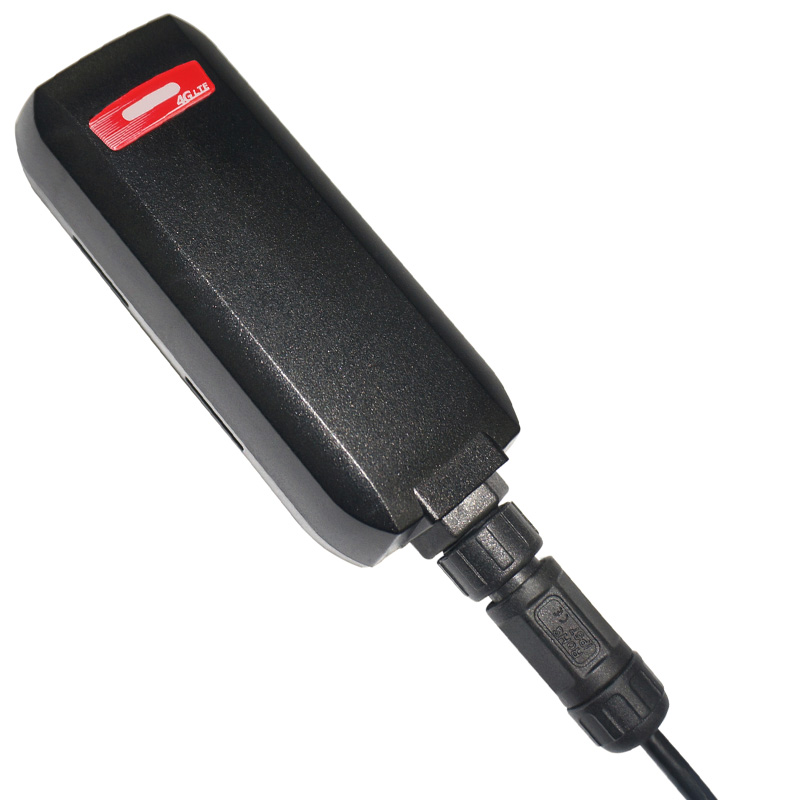

# GlobalSat - GTR-388

The GlobalSat GTR-388C1 is a 4G LTE GPS tracker specifically designed for eBikes, motorcycles, and vehicles. With its durable and multi-functional design, this tracker offers highly efficient Cat 1 LTE connectivity, with seamless fallback to 2G and 3G networks. Its compact size and robust, waterproof construction make it ideal for installation on motorcycles, electric scooters, and vehicles of all kinds.

One of the standout features of the GTR-388C1 is its dual-band UMTS/HSDPA WCDMA system, which ensures reliable and fast communication. It also features a dual-band GSM/GPRS/EDGE system for added flexibility. The tracker is equipped with a high-sensitivity GPS receiver, allowing for accurate and precise location tracking. Its built-in motion sensor enables motion detection and provides an added layer of security.

The GTR-388C1 supports various communication protocols, including SMS, TCP, UDP, and HTTP, ensuring seamless integration with existing systems. It also offers multiple I/Os support, including a digital input for custom functions, a digital input for an optional emergency button, an analog input, and a digital output for relay control. The tracker's firmware can be easily updated via Over-The-Air \(OTA\), eliminating the need for manual updates.

With its small size and easy installation, the GTR-388C1 is a versatile GPS tracker suitable for a wide range of applications. Its perfect power management control ensures efficient use of battery power, and its thermal solution with IPX7 design and waterproof cable connector guarantee durability and reliability in any weather conditions.

### Key Features:

- Dual-Band UMTS/HSDPA WCDMA system
- Dual-Band GSM/GPRS/EDGE system
- 820mAh rechargeable battery
- High sensitivity GPS receiver
- Compact size and Waterproof IPX7 design
- Built-in high sensitivity GPS/GSM antennas
- Built-in motion sensor
- AGPS support
- Support communication protocols - SMS/TCP/UDP/HTTP
- Multiple I/Os support
- Firmware update via Over-The-Air
- Small size for easy installation
- Perfect power management control
- Thermal solution with IPX7 design and waterproof cable connector

