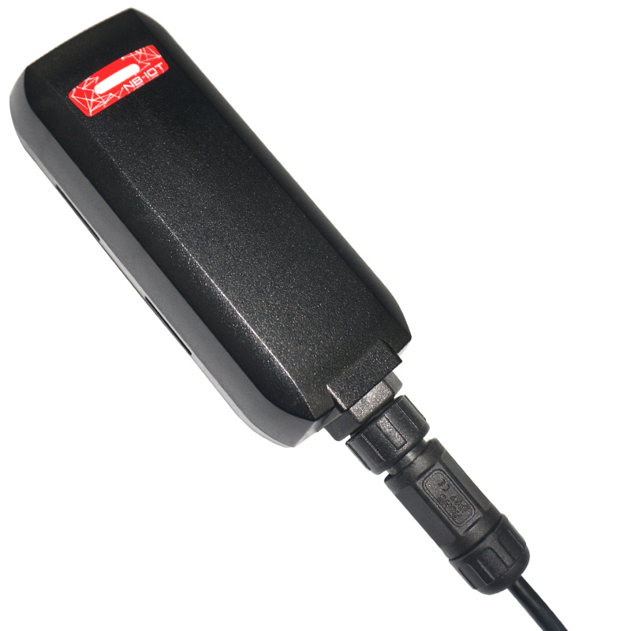

# GlobalSat - GTR-388NB

The GTR-388NB is a compact, rugged NB‑IoT GPS tracker purpose-built for eBikes, motorcycles, scooters and light vehicles. As a Plaspy compatible device, it delivers waterproof, low‑power real‑time tracking and reliable telemetry in harsh outdoor conditions. Its small form factor and straightforward wiring make installation quick, while the built‑in GNSS and GSM antennas plus AGPS support ensure consistent position fixes for fleet management and anti‑theft workflows.

Designed with vehicle telematics in mind, the GTR‑388NB supports NB‑IoT communication on bands B3, B8, B20 and B28 and transmits data over UDP. With an internal motion \(G\) sensor, LED status indicators, an 820 mAh rechargeable backup battery and optimized power management, this Plaspy compatible GPS tracker balances long standby life with dependable live updates. Optional accessories \(relay, OBDII cable, emergency button, firmware/debug cable\) simplify integration into shared micromobility and motorcycle anti‑theft solutions.

## Key Highlights

- Plaspy compatible NB‑IoT GPS tracker for reliable real‑time tracking and fleet management of light vehicles and scooters.
- Rugged, waterproof IPX7 enclosure for outdoor use on motorcycles and eBikes.
- Low‑power design with 820 mAh backup battery and optimized standby for long uptime and telemetry reporting.
- Built‑in high‑sensitivity ceramic patch GNSS antenna and AGPS support for faster fixes and accurate position data.
- Multiple I/O for ignition \(ACC\) detection, emergency button input, analog telemetry \(0–28 V\) and relay control for immobilizer or accessories.
- NB‑IoT connectivity on B3, B8, B20, B28 with UDP data transport—suitable for low‑bandwidth, wide‑area deployments.
- Compact, lightweight form factor \(107.5 x 38.7 x 22.8 mm, 66.5 g\) for unobtrusive mounting and shared mobility fleets.

## How It Works with Plaspy

When integrated with Plaspy, the GTR‑388NB streams position and vehicle telemetry to your Plaspy account using NB‑IoT. Plaspy ingests UDP packets from the tracker and converts them into live map markers, geofence events, historical trails and alert notifications. Plaspy’s dashboard and APIs make it easy to combine the GTR‑388NB’s telemetry with other data sources for unified fleet management and anti‑theft workflows.

- Real‑time location and telemetry updates: GNSS coordinates, timestamp, and motion state are forwarded to Plaspy for live tracking and history playback.
- Ignition status and ACC detection: the dedicated ACC input reports ignition on/off events to Plaspy for trip logging and engine state monitoring.
- Analog telemetry \(0–28 V\): supports voltage‑based sensors—usable for fuel monitoring or battery voltage reporting when configured with Plaspy.
- Remote immobilizer / relay control: the negative‑trigger digital output can be used as an immobilizer control via Plaspy commands when paired with an appropriate relay accessory.
- Emergency and tamper alerts: a dedicated emergency input and internal motion \(G\) sensor enable theft and movement alerts routed to Plaspy notifications.
- Data consolidation: Plaspy can combine GTR‑388NB telemetry with other sensor data \(including Bluetooth sensors managed separately\) for richer monitoring and reporting.

## Technical Overview

| Model | GTR‑388NB |
| --- | --- |
| Connectivity | NB‑IoT \(UDP\) |
| Bands | B3, B8, B20, B28 |
| Power & Battery | Input +12 V to +30 V; internal 820 mAh rechargeable backup battery; optimized power management |
| Interfaces | One digital input \(custom\), one emergency digital input, one analog input \(0–28 V\), one digital output \(negative trigger, up to 300 mA\), ACC/ignition digital input |
| GNSS | Built‑in ceramic patch GNSS antenna; AGPS support; high‑sensitivity GPS |
| Antennas | Built‑in ceramic patch GNSS antenna; built‑in Pi‑Fa GSM antenna |
| Memory | 32 Mb internal memory |
| SIM | Micro SIM |
| Indicators & Controls | LED indicators for network/server states, reset button, hiding mode |
| Physical | 107.5 x 38.7 x 22.8 mm; 66.5 g; IPX7 waterproof enclosure |
| Environmental | Operating -30°C to +60°C \(charging 0°C to +45°C\); storage -40°C to +60°C; humidity 5%–95% non‑condensing |
| Certifications | CE, FCC, NCC |
| Remote Management | Firmware update/debug cable \(optional\); local firmware update via cable supported \(no cloud FOTA specified\) |
| Accessories | Includes 8‑pin hard wire power & I/O cable, two Velcro tapes, Quick Start Guide. Optional: relay, OBDII power cable, external emergency button, cigar lighter cable, test box, firmware/debug cable. |
| Bluetooth | No Bluetooth module described \(Plaspy can still consolidate external Bluetooth sensor data separately\) |

## Use Cases

- Fleet management for light vehicles and motorcycle fleets—real‑time tracking, trip logs and ignition‑based reporting through Plaspy.
- Anti‑theft and remote immobilization for scooters and motorcycles—motion detection, emergency input and relay control enable Plaspy‑driven interventions.
- Shared micromobility monitoring—compact, waterproof design suits eBike and scooter sharing fleets that require unobtrusive installation.
- Vehicle telematics and voltage‑based telemetry—analog input allows integration of simple fuel or battery voltage sensing into Plaspy reports.
- General asset tracking in harsh environments—IPX7 protection and a rugged enclosure keep the device operational outdoors.

## Why Choose This Tracker with Plaspy

The GTR‑388NB is an excellent choice when you need a Plaspy compatible GPS tracker that combines rugged reliability, compact design and low‑power NB‑IoT connectivity. Its IPX7 waterproof rating and wide operating temperature range make it suitable for outdoor vehicle installations, while the internal backup battery and motion sensor reduce false alerts and improve continuity of tracking. For fleet management and anti‑theft applications, the device’s ACC input, emergency input and relay output provide pragmatic control points for ignition‑based reporting and immobilizer integration via Plaspy.

Because the GTR‑388NB transmits over NB‑IoT \(B3/B8/B20/B28\) with UDP, it supports efficient, wide‑area coverage with minimal data usage—ideal for large deployments and telemetry reporting. Plaspy leverages that data to deliver real‑time tracking, customizable alerts, historical trip analytics and API access for integration into your operational systems. Combined with optional accessories \(relay, OBDII cable, emergency button\), the GTR‑388NB offers a scalable, low‑profile solution for managing scooters, motorcycles and other light vehicles with confidence.

