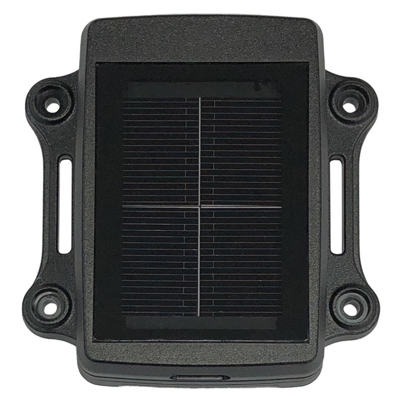

# GlobalSat - LT-20

The GlobalSat LT-20 (often referenced as LT-20P in manufacturer materials) is a compact solar powered LoRa GPS tracker designed for outdoor asset monitoring. It is built to provide long lasting location transmission for assets such as cattle, livestock, and farming equipment. Key product characteristics include a high performance solar panel for continuous transmission, a high sensitivity GPS GNSS receiver for reliable positioning, a built in 3 axis accelerometer for motion detection, and an IPX7 waterproof rating for use in exposed conditions.

As a Plaspy compatible device, the LT-20 can feed location, motion, and power status information into Plaspy to improve visibility across agricultural and outdoor fleets. Its solar charging and low power alert features make it particularly well suited to long term deployments where regular maintenance is challenging. When used with Plaspy, the LT-20 helps teams monitor assets remotely, receive motion or low battery notifications, and retain historical location records for operational oversight.

## Key Highlights

- Solar powered design supports extended outdoor deployment and reduces the need for frequent battery changes
- LoRa transmission optimized for long range outdoor communication in remote areas
- High sensitivity GPS GNSS receiver provides reliable location data for moving assets
- Built in 3 axis accelerometer enables motion detection and tamper awareness
- Low power alert notifies administrators when device power is running low
- IPX7 waterproof rating suitable for a variety of weather exposed environments
- Compact and lightweight form factor for simple surface mounting on assets

## How It Works with Plaspy

When integrated with Plaspy, the LT-20 sends position updates, motion events, and power alerts into the Plaspy platform where teams can monitor assets on maps and in reports. Plaspy consolidates these inputs to provide situational awareness and operational insights across distributed outdoor deployments.

- Display live and recent location points on Plaspy maps for fleet and asset visibility
- Receive motion alerts and low power notifications routed to the appropriate users or groups
- Maintain historical tracks and location history for auditing and operational analysis
- Use location based alerts and reporting within Plaspy to detect unusual activity or movement
- Combine LT-20 data with other devices in Plaspy to manage mixed fleets and site assets

## Typical Use Cases

- Tracking cattle and other grazing livestock across large pastures
- Monitoring tractors, trailers, and farming equipment in remote fields
- Long term asset monitoring where solar charging reduces maintenance visits
- Tamper and movement detection for valuable outdoor assets
- Environmental or remote site asset tracking where weather resistance is required

## Why Choose This Tracker with Plaspy

The LT-20 is a practical choice for agricultural and outdoor asset tracking when paired with Plaspy because it combines solar endurance, long range LoRa connectivity, and motion detection in a compact package. For organizations that need persistent visibility of dispersed assets, the device's design reduces upkeep while delivering the core signals Plaspy uses for monitoring and reporting.

Plaspy adds operational context to the LT-20 data by presenting locations, alerts, and history in a unified platform. That combination helps teams focus on exceptions, optimize asset use, and maintain oversight with fewer field visits while keeping the deployment manageable.

To learn more about how Plaspy can work with devices like the GlobalSat LT-20 visit https://www.plaspy.com. Product specifications and availability can change over time, so please verify current technical details and regional variants on the manufacturer site https://www.globalsat.com.tw/ before purchase.
