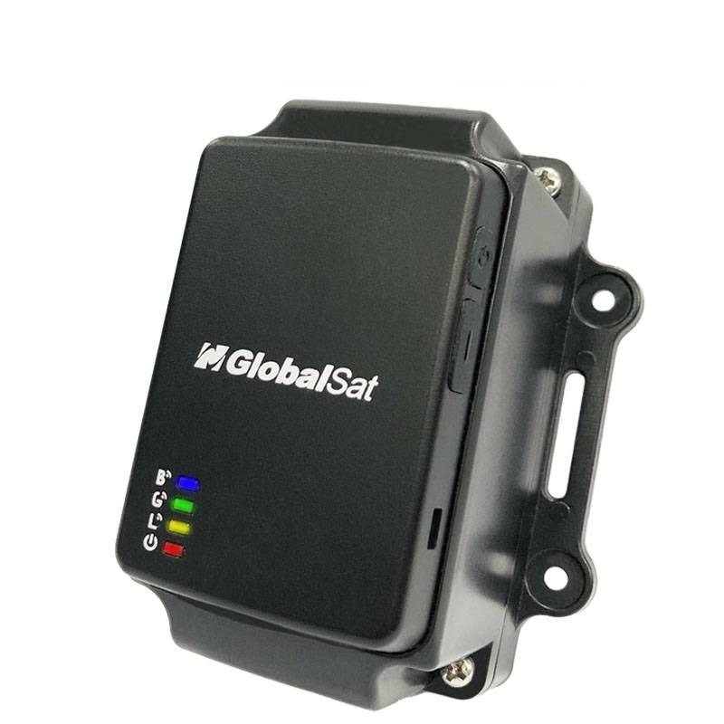

# GlobalSat - LT-501R

The LT-501R Series is a compact, Plaspy compatible LoRa GPS asset tracker designed for reliable indoor/outdoor monitoring, long battery life, and straightforward fleet management or asset protection workflows. Built around a Semtech SX-1276 LoRa chipset with LoRaWAN™ Class A and Class C support and native Helium Network compatibility, the LT-501R delivers configurable real-time tracking, remote pinging, and flexible reporting intervals so teams can monitor location and telemetry where cellular coverage is limited or costly.

Optimized for asset use rather than heavy vehicle telematics, the LT-501R combines GPS location, BLE beacon support, and a 3-axis accelerometer to enable motion-based alerts, anti-theft notification tones \(via a built-in buzzer\), and BLE sensor detection for indoor positioning. Its lightweight form factor, replaceable 19A battery option, and IPX7 protection make it a practical Plaspy compatible solution for equipment, trailers, and other portable assets requiring long-life monitoring.

## Key Highlights

- Plaspy compatible LoRaWAN tracking: integrates with Helium and LoRaWAN™ networks for low-power, long-range telemetry and real-time tracking.
- Long battery life: replaceable 19A battery with an estimated ~130 days on a 5-minute GPS reporting interval \(reference only\) for extended deployments.
- Indoor + outdoor positioning: GPS patch antenna plus BLE beacon support for hybrid location solutions and improved indoor tracking.
- Motion & audible alerts: built-in 3-axis accelerometer for movement detection and a buzzer for anti-theft and low-power notifications.
- Robust radio performance: Semtech SX-1276 LoRa chipset with typical LoRa range of 1–10 km \(at 980 bps\) and receiving sensitivity down to −128 dBm.
- Rugged and certified: IPX7 \(with proper rubber cover\), multiple regional certifications \(CE, FCC, Telec\) and LoRaWAN™ / ThingPark certifications.
- Flexible regional options: frequency variants available for US/AS and EU regions to match regional deployments.

## How It Works with Plaspy

When paired with Plaspy, the LT-501R streams location and sensor telemetry over LoRaWAN to your Plaspy workspace or private Helium integration. Plaspy ingests the device payloads — position fixes, accelerometer events, BLE beacon detections, and device state — and converts them into real-time tracking, alerts, and historical reports suited for asset tracking and fleet management dashboards.

- Real-time location and telemetry updates delivered via LoRaWAN \(Helium-compatible\) to Plaspy for live mapping and history playback.
- Motion and tamper alerts from the 3-axis accelerometer trigger immediate Plaspy notifications for anti-theft response.
- BLE beacon and sensor detections provide improved indoor positioning and enable Bluetooth sensor integrations for asset telemetry.
- Configurable reporting intervals and GPS enable/disable allow Plaspy to balance update frequency and battery life based on use case.
- Remote pinging from Plaspy can wake the device for on-demand tracking and troubleshooting when needed.

## Technical Overview

| Model | LT-501R Series |
| --- | --- |
| Connectivity | LoRa \(Semtech SX-1276\), LoRaWAN™ Class A & Class C; Helium Network compatible; Nordic BLE \(slave mode\) |
| Bands / Variants | LT-501RH: US 915 MHz / AS 923 MHz; LT-501RE: EU 868 MHz |
| Transmission Range | Typical LoRa range 1–10 km at 980 bps; BLE range up to ~35 m |
| Receiving Sensitivity | Down to −128 dBm \(at 980 bps\) |
| Power & Battery | Replaceable 19A battery \(optional\); estimated ~130 days at 5-minute GPS reporting \(reference only\); operation voltage DC 3.3–4.3V \(USB 4.5–5.5V\) |
| GNSS & Antenna | GPS patch antenna \(18 × 18 × 2 mm\) with MMCX option for external GPS antenna; supports outdoor & assisted indoor geo-location |
| Interfaces & Indicators | Micro USB connector for charging/configuration, internal LoRa/BLE antennas, MMCX external antenna option, multiple LED indicators \(power, GPS, LoRa, BLE\), buzzer, built-in watchdog |
| Sensors | Built-in 3-axis accelerometer \(motion detection\) |
| Environmental | Operating temperature −20 to 60°C \(with battery\); storage −20 to 80°C; humidity 5–95% non-condensing; IPX7 with proper rubber cover sealing |
| Certifications | CE, FCC, Telec, LoRaWAN™ Certification, ThingPark certification |
| Accessories | Included Micro USB cable; optional 19A battery, optional external GPS antenna, optional 3 mm steel mounting plate |
| Form Factor | Compact, lightweight asset tracker designed for indoor/outdoor deployments |

## Use Cases

- Fleet management for non-powered assets: track trailers, containers, and equipment across yards and worksites using Plaspy mapping and reports.
- Anti-theft monitoring: motion detection and buzzer alerts provide immediate notification through Plaspy when an asset moves unexpectedly.
- Indoor/outdoor handoff tracking: BLE beacon support and GPS combine to provide improved location fidelity when assets move between indoors and outdoors.
- Telemetry and status monitoring: low-power telemetry and periodic reporting help teams monitor asset presence and battery state over long deployments.
- Temporary deployments and rentals: replaceable battery and simple USB configuration make the LT-501R practical for short-term asset tracking and recovery workflows.

## Why Choose This Tracker with Plaspy

The LT-501R Series offers a focused, Plaspy compatible solution for organizations that need long-life, low-power GPS tracking with LoRaWAN reach. Its combination of GPS, BLE beacon capability, accelerometer-based motion detection, and Helium network support gives teams flexible telemetry and anti-theft functionality without the power demands of cellular units. For fleet management and asset protection workflows, the LT-501R delivers dependable location updates, audible alerts, and region-specific radio variants to match deployment needs.

While the LT-501R is optimized for asset-level tracking \(BLE sensors, motion detection, and beacon-based indoor positioning\), Plaspy can aggregate data across your telematics stack to provide broader telemetry — including ignition/immobilizer or fuel monitoring — when combined with vehicle-grade interfaces or additional sensors. Choose the LT-501R with Plaspy when you need a robust, certified LoRa GPS tracker that balances long battery life, reliable telemetry, and easy integration into modern asset and fleet management platforms.

