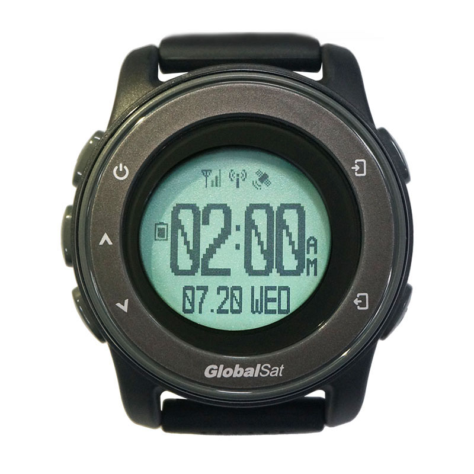

# GlobalSat - NW-360HR

The NW-360HR is a wearable GPS tracker watch designed for personal safety, lone worker monitoring, and continuous physiological telemetry. It combines GPS positioning with BLE beacon capability and low power wide area cellular connectivity to provide location and basic indoor positioning alongside health related sensors such as optical heart rate and skin temperature. The watch also incorporates an SOS help button and fall advisory logic so users can report emergencies or generate automated incident events.

This model is Plaspy compatible out of the box, making it a practical choice for teams that need integrated location, health context, and event notifications within a centralized monitoring platform. Data from the device can be ingested by Plaspy for real time tracking, alerting, and reporting workflows, which helps caregivers, safety teams, and operators keep visibility over people and portable assets without custom hardware protocols.

## Key Highlights

- Wearable GPS tracker that combines location and physiological telemetry for centralized monitoring in Plaspy
- Low power wide area cellular connectivity via LTE M1 and NB IoT for reliable uplink in broad coverage areas
- GPS plus BLE beacon support to improve positioning accuracy across outdoor and indoor environments
- Integrated SOS help button and fall advisory for emergency alerts and automated incident detection
- Continuous heart rate and skin temperature telemetry alongside a 3 axis accelerometer for activity and motion reporting
- Practical battery life around 48 hours on typical reporting intervals with a supplied charging cable for routine use

## How It Works with Plaspy

The NW-360HR transmits location, BLE beacon information, sensor telemetry, and event notifications over cellular networks to backend services. Plaspy ingests that incoming data stream so location, vitals, and alerts appear within dashboards, maps, and notification workflows for operations teams and caregivers.

- Real time location updates and sensor telemetry delivered to Plaspy for live monitoring
- SOS help button sends immediate alerts and shared position to responder workflows
- Fall advisory and motion triggered reports generate automated incident events in Plaspy
- Physiological metrics such as heart rate and skin temperature are shown alongside location for contextual monitoring
- BLE beacon data supports improved indoor positioning and proximity events within Plaspy views

## Typical Use Cases

- Elder care and assisted living monitoring where location plus vital signs help caregivers manage risk
- Lone worker protection for field staff with SOS alerts and fall detection routed to response teams
- Personal security and rapid response scenarios that need wearable SOS and location context for first responders
- Health and activity monitoring programs that combine location and telemetry for population or patient oversight
- Portable asset or equipment protection that benefits from combined GPS and BLE proximity awareness

## Why Choose This Tracker with Plaspy

The NW-360HR is well suited for organizations that need a compact, rugged wearable to extend real time tracking and health telemetry into Plaspy. Its combination of SOS, fall advisory, motion reporting, and physiological sensors provides actionable context when incidents occur, while standard IoT backend compatibility keeps integration straightforward. For teams focused on personal safety and remote personnel oversight, the watch delivers the core features required for continuous monitoring and timely alerts.

If you want to learn more about how Plaspy supports devices like the NW-360HR, visit https://www.plaspy.com. Product specifications and availability can change over time, so please verify current technical details and manufacturer information on the official GlobalSat site https://www.globalsat.com.tw/.
