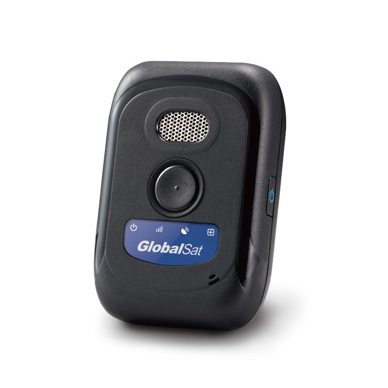

# GlobalSat - TR-300

The GlobalSat TR-300 is a compact, lightweight personal tracker built for reliable everyday tracking and safety monitoring. Designed with children and elders in mind, it combines straightforward operation with practical safety features such as two-way communication via a built in microphone and speaker, an SOS button for quick alerts, and long battery life to reduce the need for frequent charging. The TR-300 supports remote monitoring and configuration so caregivers or monitoring centers can follow location and safety events as needed.

As a Plaspy compatible device, the TR-300 can be integrated into Plaspy's tracking platform to provide centralized visibility and management. Plaspy can receive location updates and event notifications from the device, display real time and historical position data on maps, and allow teams to configure alerts and oversight workflows that match their operational needs. Compatibility makes it easier to include the TR-300 in broader monitoring or reporting processes managed from Plaspy.

## Key Highlights

- Compact and lightweight design that is easy for individuals to carry or wear
- Built in microphone and speaker for two way hands free communication
- High capacity battery designed for extended usage between charges
- Dedicated SOS button for immediate alerting to pre configured contacts
- Remote configuration and tracking capability to support monitoring centers
- Geo fence support for defining permissible or restricted areas
- Operates on 3G networks and supports remote commands via GPRS and SMS

## How It Works with Plaspy

When paired with Plaspy, the TR-300 becomes part of a centralized monitoring workflow where location and event information is presented alongside other devices. Plaspy ingests the tracker data and makes it actionable for operators, caregivers, and managers.

- Real time location display on Plaspy maps for immediate visibility
- Historical route and position playback to review past movements
- SOS and alert events routed into Plaspy notification channels for quick response
- Geo fence events translated into alerts and automated rules within Plaspy
- Reporting and exportable activity logs to support oversight and record keeping

## Typical Use Cases

- Monitoring young children for caregivers who want simple location awareness and quick communication
- Supporting elder care with emergency alerting and remote check in capabilities
- Lone worker safety for individuals who need a compact personal alarm and tracking device
- Short term or temporary personal protection during travel or outings
- Light asset or equipment tracking where a small, user friendly tracker is preferred

## Why Choose This Tracker with Plaspy

The TR-300 pairs practical personal safety features with straightforward remote monitoring, making it a sensible option for organizations and families that need dependable tracking without complex devices. Its emphasis on ease of use, long battery life, and SOS functionality aligns well with Plaspy workflows focused on situational awareness, alerting, and simple reporting.

For teams already using Plaspy or evaluating compatible hardware, the TR-300 offers a balance between portability and capability that supports caregiver workflows and basic operational oversight. Its feature set is especially relevant where two way communication and emergency alerting are priorities, and Plaspy can centralize those events alongside other tracking assets.

Learn more about Plaspy on the main website https://www.plaspy.com. Product specifications and availability may change over time, so please verify current details on the manufacturer site https://www.globalsat.com.tw/.
