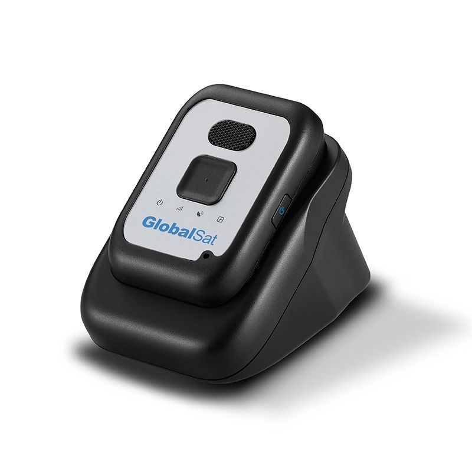

# GlobalSat - TR-313

The GlobalSat TR-313 is a compact 3G personal GPS tracker designed for straightforward location monitoring and personal safety. It combines a fast acquisition GPS module with a small, lightweight form factor and user friendly operation. Built in two way audio and a dedicated emergency button extend the device beyond basic tracking to support immediate voice contact and quick alerting to pre set contacts when help is needed.

As a Plaspy compatible device, the TR-313 can be integrated into centralized tracking workflows to provide continuous visibility and operational oversight. Plaspy can ingest the device's location and status information to display positions on maps, trigger notifications, and include the device in device lists and reports — helping organizations and caregivers manage monitoring tasks from a single platform.

## Key Highlights

- Compact and lightweight design suitable for personal use and easy daily carry
- Fast acquisition GPS module for prompt and accurate location fixes
- Built in microphone and speaker for hands free two way voice communication
- Emergency button that calls pre set numbers and issues quick alerts
- Designed primarily for personal tracking applications such as child and elder safety
- Compatibility with Plaspy for centralized monitoring and device management

## How It Works with Plaspy

When used with Plaspy, the TR-313 provides location and status visibility that can be incorporated into fleet or device monitoring dashboards. Plaspy consolidates incoming information to help teams and caregivers see device movements, receive alerts, and generate activity reports without managing each device separately.

- Display real time and recent location history on Plaspy maps for quick situational awareness
- Configure alert triggers in Plaspy to notify operators when emergency signals or predefined events occur
- Group and organize TR-313 units within Plaspy for role based oversight and easier device management
- Include TR-313 data in scheduled and ad hoc reports to track movement patterns and usage
- Use Plaspy notifications to escalate incidents detected from the device to the right contacts

## Typical Use Cases

- Child safety and location monitoring for parents who want remote visibility
- Elderly care oversight where quick alerts and two way voice add reassurance
- Personal security for lone commuters or individuals needing an emergency contact option
- Short term monitoring of contractors or temporary staff where simple tracking is required
- Small scale asset oversight where compact personal trackers are sufficient

## Why Choose This Tracker with Plaspy

The TR-313 is a sensible choice for organizations and individuals who need a compact personal tracker with added safety features. Its combination of fast GPS acquisition, hands free voice capability, and an emergency button makes it suited to caregiving and personal safety scenarios where both location and communication matter. Pairing the device with Plaspy brings those capabilities into a managed platform for consistent monitoring and oversight.

If you want centralized visibility and a simple way to manage alerts, the TR-313 together with Plaspy provides a practical option for personal monitoring programs. Learn more about Plaspy on the main website https://www.plaspy.com and verify current product specifications, availability, and manufacturer details on the official GlobalSat site https://www.globalsat.com.tw/. Product specifications and availability can change over time, so please confirm the latest details with the manufacturer before making purchasing or deployment decisions.
