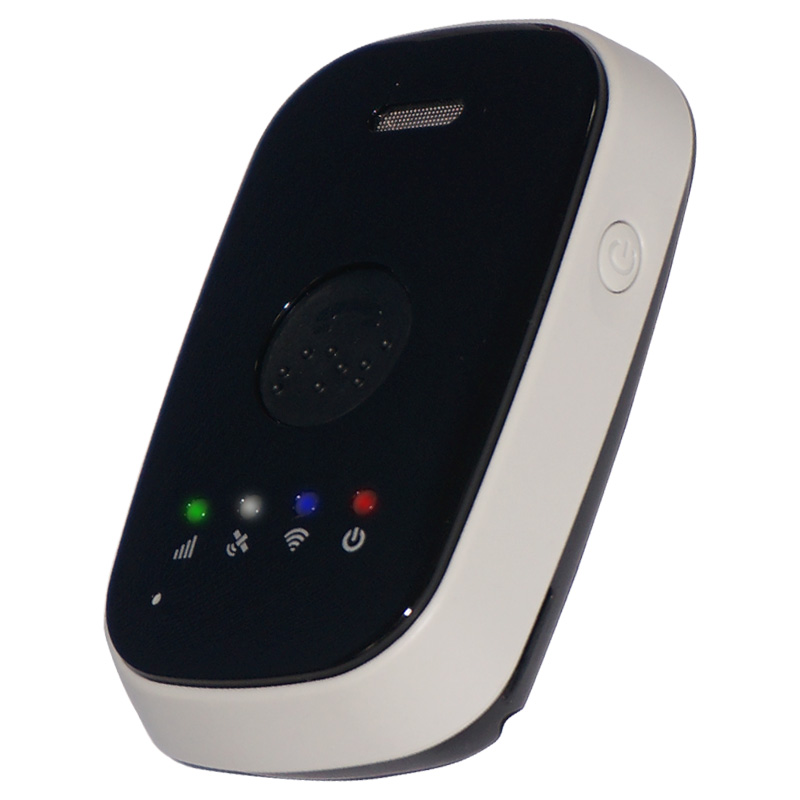

# GlobalSat - TR-350

The TR-350 is a compact personal GPS tracker from GlobalSat designed for reliable safety monitoring of seniors, children and lone workers. It is built as a wearable device for mobile personal emergency response systems, delivering real-time location updates along with one-button SOS, two-way voice, motion and fall advisories, and status indicators for battery and connectivity. The TR-350 combines high-sensitivity GNSS with Wi‑Fi positioning and Bluetooth LE beacon scanning to improve location accuracy both outdoors and indoors.

As a Plaspy compatible device, the TR-350 pairs directly with Plaspy to bring device telemetry and events into a unified monitoring environment. That compatibility means Plaspy can ingest SOS triggers, motion and fall alerts, voice call events, and periodic location updates so operators, caregivers and response teams can monitor device status, receive notifications, and act on incidents from a single platform.

## Key Highlights

- Compact wearable form factor tailored for personal safety and MPERS programs.
- Plaspy compatible for streamlined integration with real time monitoring and alerting.
- High-sensitivity GNSS plus Wi‑Fi and Bluetooth LE beacon scanning to enhance indoor positioning.
- One-button SOS with two-way voice communication for direct caregiver or response center contact.
- Motion reporting and fall advisory features to support automated incident detection.
- Battery and connectivity status reporting to help manage device health and uptime.
- IPX6 water resistance and vibration or ringtone alarms for durable wearable use.

## How It Works with Plaspy

When connected to Plaspy, the TR-350 uploads its location and event data so monitoring teams receive continuous visibility and contextual alerts. Plaspy aggregates GNSS fixes along with Wi‑Fi and Bluetooth beacon inputs to improve position accuracy and routes SOS, motion and fall events into configurable alert workflows. This integration helps translate device signals into actionable notifications and reporting for operational oversight.

- Real time location and status updates visible in Plaspy dashboards for tracking and oversight.
- SOS and emergency call events routed into Plaspy alerting channels and incident workflows.
- Motion and fall advisories converted into automated notifications to reduce response time.
- Battery level and connectivity status reporting to manage device availability and maintenance.
- Indoor positioning enhancements via Wi‑Fi and Bluetooth beacon data to improve event context.

## Typical Use Cases

- Senior care and assisted living monitoring to detect falls and enable rapid response.
- Child safety and supervision programs requiring location updates and emergency call capability.
- Lone worker protection for staff operating remotely or in at-risk environments.
- MPERS and subscription monitoring services that need compact wearable devices for clients.
- Short term deployments, rentals or events where easy distribution and wearable tracking are required.

## Why Choose This Tracker with Plaspy

The TR-350 is a focused personal safety tracker that complements Plaspy by delivering targeted telemetry and emergency communication features for vulnerable users. Its combination of GNSS positioning plus Wi‑Fi and Bluetooth LE assists helps provide richer location context, and the native SOS and two-way voice functions simplify incident workflows for caregivers and response centers. For organizations using Plaspy, the TR-350 can be added to monitoring programs to extend visibility to people and personal assets without introducing vehicle specific complexity.

While the TR-350 is optimized for personal monitoring rather than vehicle telematics, Plaspy can consolidate TR-350 telemetry alongside other asset data for unified reporting and alerting across mixed deployments. If you want to learn more about how Plaspy supports devices like the TR-350 and how it can fit into your monitoring operations please visit https://www.plaspy.com. For the most current product specifications, regional availability and manufacturer details please verify information with the official GlobalSat site at https://www.globalsat.com.tw/ as product details can change over time.
