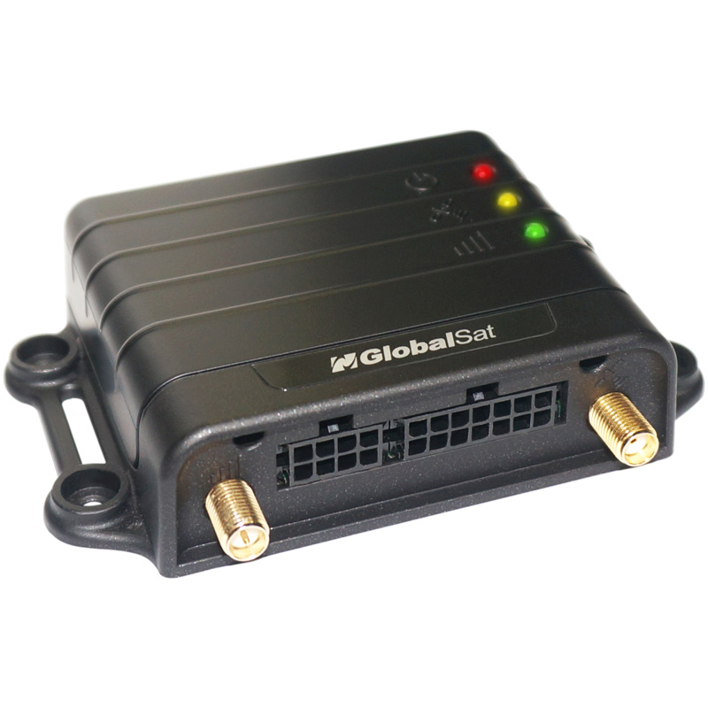

# GlobalSat - TR-616C1

The TR-616C1 is a compact vehicle mounted 4G LTE GPS tracker designed for practical fleet and asset management. It combines a high sensitivity GNSS receiver, multi band cellular modem and a rugged installable housing to provide accurate real time location and essential vehicle telemetry suitable for continuous tracking and event reporting.

As a Plaspy compatible device, the TR-616C1 transmits position updates, event messages and telemetry into the Plaspy platform for immediate visibility, alerts and reporting. Its support for TCP UDP SMS reporting, remote configuration, OTA firmware updates and AT command control makes it straightforward to integrate with Plaspy for fleet monitoring, historic playback and operational oversight.

## Key Highlights

- Plaspy compatible for real time GPS position reporting and vehicle status via TCP UDP and SMS.
- Multi mode cellular connectivity for broad regional coverage and fallback.
- High sensitivity GNSS receiver and active antenna design for reliable location performance.
- Buffered tracking that stores thousands of points to prevent gaps during connectivity loss.
- Vehicle telemetry inputs such as ignition status plus dedicated LEDs for cellular GPS and power states.
- Built in backup battery for short term operation during vehicle power loss.
- Remote management capabilities including OTA updates and remote configuration for reduced field visits.

## How It Works with Plaspy

The TR-616C1 sends location, events and telemetry to Plaspy endpoints where the platform ingests, displays and stores data for live monitoring, historical analysis and alerting. Plaspy uses incoming messages from the tracker to trigger notifications, populate reports and maintain continuity when devices reconnect and upload buffered points.

- Real time location and telemetry delivered to Plaspy via TCP UDP or SMS.
- Ignition status reporting to support drive time analytics and on off events.
- Buffered upload of stored location points when network connectivity is restored to preserve history.
- Event driven alerts for geo fence triggers, motion detection and power loss forwarded to Plaspy for instant notification.
- Remote configuration and OTA firmware updates managed through network commands to keep devices synchronized with reporting rules.
- Integration with optional relay modules to enable immobilization or other remote workflows when paired with appropriate accessories.

## Typical Use Cases

- Fleet management with live tracking, route replay and utilization reporting for operational oversight.
- Anti theft and recovery deployments using motion and power loss alerts plus backup battery endurance.
- Logistics and transport visibility where buffered logging maintains position history during intermittent coverage.
- Driver safety and incident monitoring through ignition and motion event reporting.
- Remote device lifecycle management using OTA updates and centralized configuration to reduce field service.

## Why Choose This Tracker with Plaspy

The TR-616C1 offers a balanced combination of compact form factor, reliable connectivity and offline buffering that pairs naturally with Plaspy’s fleet tracking and reporting capabilities. Its support for remote management and common reporting channels helps reduce integration time and ongoing maintenance, while buffered logging and a backup power source help preserve continuity for critical tracking workflows.

For organizations that need practical telematics for vehicle fleets, the TR-616C1 provides a cost effective platform to deliver position and event data into Plaspy for alerts, dashboards and operational reporting. To learn more about Plaspy and how compatible devices work with the platform visit https://www.plaspy.com. Product specifications, availability and manufacturer details can change over time, so please verify current specifications on the manufacturer website https://www.globalsat.com.tw/.
