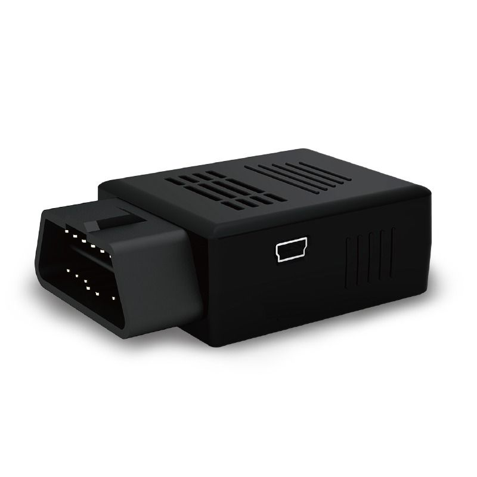

# GlobalSat - TR-900

The GlobalSat TR-900 is a compact OBDII dongle designed for vehicle tracking and diagnostic data capture. As a plug and play device that connects to a vehicle OBDII port, the TR-900 provides GPS positioning together with vehicle diagnostic information and event capture. The device description highlights 3G network connectivity, a high-sensitivity G sensor for detecting harsh driving and impacts, and a flexible event based protocol for customized alerting and reporting.

Because the TR-900 provides both location and vehicle diagnostics, it is a practical choice for integration with Plaspy. Compatible with Plaspy, the TR-900 can feed position data, mileage, diagnostic trouble code captures, and event data into the Plaspy platform to support fleet visibility, driver behavior analysis, alerts, and operational reporting without extensive additional hardware changes.

## Key Highlights

- Plug and play OBDII dongle form factor for straightforward vehicle connection
- Accurate GPS positioning combined with vehicle diagnostic data capture
- 3G network connectivity supporting UMTS and GPRS for data transmission
- High-sensitivity G sensor for monitoring harsh driving and impact events
- Built-in reporting features such as mileage accumulation and impact alerts
- Event based protocol that can combine OBDII data and GPS location for custom alerts

## How It Works with Plaspy

When used with Plaspy, the TR-900 supplies location and vehicle diagnostic events that Plaspy ingests to provide a unified view of vehicle status and activity. Plaspy can present the combined data in dashboards, alert rules, and reports to support fleet operations and decision making.

- Real time and historical vehicle location tracking for fleet visibility
- Driver behavior and harsh driving alerts derived from G sensor events
- Vehicle health and diagnostics reporting including DTC and MIL status alerts
- Mileage and utilization reporting to support operational metrics and billing
- Custom event rules that combine OBDII diagnostic inputs and GPS location for tailored alerts and workflows

## Typical Use Cases

- Fleet vehicle tracking for routing, dispatch, and utilization monitoring
- Driver safety programs that detect harsh braking, acceleration, and impacts
- Vehicle health monitoring and preventive maintenance based on diagnostic alerts
- Mileage reporting for billing, reimbursement, or utilization analysis
- Incident and impact investigation using combined GPS and event logs

## Why Choose This Tracker with Plaspy

The TR-900 pairs vehicle location with onboard diagnostic signals, giving fleet managers richer context than GPS alone. That combination enables more actionable alerts, clearer maintenance signals, and better visibility into how vehicles are used day to day. Its plug and play design helps reduce rollout time for fleets that need quick deployment and immediate telemetry.

Plaspy can turn the TR-900 data into operational insights across monitoring, alerting, and reporting workflows while preserving flexibility for custom event rules. Organizations that need both tracking and basic vehicle diagnostics in a compact form factor will find this device a practical option to evaluate alongside Plaspy.

To learn more about using the GlobalSat TR-900 with Plaspy visit https://www.plaspy.com. Product specifications, features, and availability can change over time so please verify current technical details and compatibility on the manufacturer website https://www.globalsat.com.tw/.
