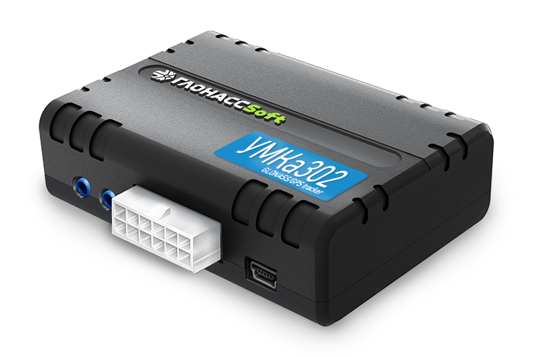

# GLONASSsoft - UMKa302

The UMKa302 is a professional grade GPS tracker from GLONASSsoft designed for vehicle monitoring, fleet management, and anti-theft protection. As a flagship model in the UMKa line, it focuses on stable operation and improved processing performance compared with earlier units. The device captures location and vehicle telemetry and is built for continuous operation in vehicle environments, offering a compact, rugged form factor suitable for a variety of fleet and asset scenarios.

This model is compatible with Plaspy, which enables operators to use the UMKa302 as a data source for live tracking, alerts, and historical reporting. By forwarding GNSS position, vehicle-derived telemetry and wireless sensor readings into Plaspy, the UMKa302 can provide the visibility and operational data that fleet managers rely on for oversight and decision making within the Plaspy platform.

## Key Highlights

- Designed for professional vehicle monitoring and fleet use with emphasis on stability and uptime.
- Streams location and telemetry for real time tracking and historical analysis.
- Supports vehicle data collection and wireless sensor integration to reduce need for multiple external devices.
- Dual SIM cellular capability and onboard logging provide resilient data delivery in variable connectivity conditions.
- Compact, vehicle ready enclosure with environmental protection suitable for in vehicle deployment.
- Flexible I/O and remote output options to support event capture and basic remote control workflows.

## How It Works with Plaspy

When connected to Plaspy, the UMKa302 transmits position updates, vehicle telemetry and sensor readings so those feeds become available inside Plaspy dashboards and reporting tools. Plaspy ingests the device data for live monitoring and archival analysis, and the tracker’s local logging helps preserve records during temporary connectivity loss.

- Real time location updates and telemetry visible in Plaspy for route monitoring and asset visibility.
- Event driven alerts and status notifications based on vehicle inputs and sensor readings.
- Historical reporting and trip playback using stored and streamed data for compliance and analysis.
- Fuel and sensor data integration to support consumption reporting and anomaly detection in Plaspy.
- Offline logging that synchronizes with Plaspy after connectivity is restored to maintain continuity of records.

## Typical Use Cases

- Fleet operations that require continuous position tracking and operational telemetry for many vehicles.
- Anti theft and security workflows where location alerts and event logs assist recovery and response.
- Fuel monitoring for fleets using combined vehicle data and wireless sensors to improve consumption reporting.
- Preventive maintenance and diagnostics by collecting vehicle parameters for oversight and planning.
- Mixed fleet or vocational vehicles where compact, resilient trackers are needed for a range of asset types.

## Why Choose This Tracker with Plaspy

The UMKa302 is a practical choice for organizations that need reliable vehicle tracking combined with richer telemetry than simple GPS position alone. Its support for vehicle data collection and wireless sensors helps consolidate readings that would otherwise require multiple devices, while onboard logging and dual SIM operation promote continuous data flow to Plaspy in real world conditions.

For Plaspy users, UMKa302 offers a balance of compact form, durable design, and data depth that helps enable live monitoring, alerts, and historical analysis without excessive additional hardware. If your priorities are resilient connectivity, integrated vehicle telemetry, and straightforward integration into a tracking platform, the UMKa302 is a model to consider.

To learn more about Plaspy and how compatible trackers are used on the platform visit https://www.plaspy.com. Product specifications and availability can change over time; please verify current technical details and options with the manufacturer at https://glonasssoft.ru/ before making procurement decisions.
