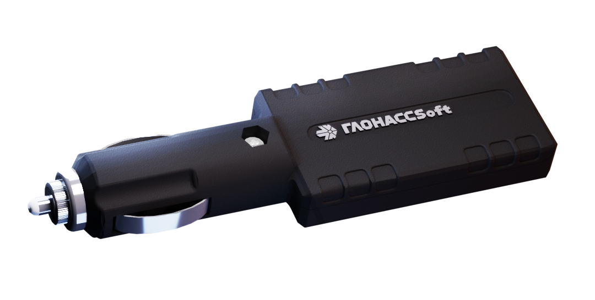

# GLONASSsoft - UMKa310 with cigarette lighter

The UMKa310 with cigarette lighter is a compact plug in GPS tracker designed for rapid deployment in vehicles. It provides GNSS based position reporting and telemetry, supports batch transfer modes to reduce data traffic, and can forward navigation and event data to multiple endpoints. The device is built for straightforward vehicle use and includes options for local configuration and extended telemetry such as fuel sensor connectivity.

As a Plaspy compatible device, the UMKa310 can integrate with Plaspy hosted backends using commonly supported open protocols. Its ability to send data simultaneously to multiple servers, support for EGTS and Wialon Combine formats, and configurable reporting behavior make it a practical choice for organizations that want to add reliable real time tracking, fuel monitoring, and event logging to their Plaspy workflows.

## Key Highlights

- Plug in cigarette lighter form factor for rapid, non permanent deployment in vehicles.
- Compatibility with EGTS and Wialon Combine binary protocol for backend integration.
- Low data consumption via batch transfer while maintaining frequent location updates.
- Optional RS 485 connection for fuel sensor integration to support fuel monitoring needs.
- Bluetooth 4.0 support for local configuration and onsite adjustments.
- Built in black box storage to retain event history when connectivity is interrupted.

## How It Works with Plaspy

The UMKa310 transmits GNSS coordinates and telemetry to Plaspy compatible backends using open protocol formats the platform accepts. Devices can be configured to match reporting intervals and alert thresholds used in Plaspy, and multi server transmission provides options for redundancy or split reporting between systems.

- Real time location and telemetry visible on Plaspy maps and dashboards.
- Simultaneous transmission to multiple servers to support redundant Plaspy endpoints or parallel reporting.
- Fuel data from optional RS 485 sensors available to Plaspy for consumption and loss detection reports.
- Onboard black box preserves up to thousands of records for later upload and reconstruction within Plaspy.
- Local and remote configuration options let you align device behavior with Plaspy alerting, geofencing, and reporting policies.

## Typical Use Cases

- Fleet management for route oversight, dispatch support, and position history in Plaspy.
- Fuel monitoring and cost control by feeding fuel sensor data into Plaspy reports and alerts.
- Anti theft monitoring with fast deployment using the cigarette lighter plug and Plaspy live tracking.
- Event logging and incident reconstruction using onboard storage to fill coverage gaps.
- Temporary or rental vehicle tracking where quick installation and removal are required.

## Why Choose This Tracker with Plaspy

The UMKa310 is a practical option when you need a compact, plug and play tracker that integrates into Plaspy workflows. Its protocol compatibility and multi server reporting make backend integration flexible, while batch transfer modes help control data usage without sacrificing update frequency. Optional fuel sensor support and onboard logging extend its usefulness for operational monitoring and post event analysis.

To learn more about using the UMKa310 with Plaspy visit https://www.plaspy.com. Product specifications, availability, and manufacturer details can change over time so please verify current technical information on the official GLONASSsoft site https://glonasssoft.ru/.
