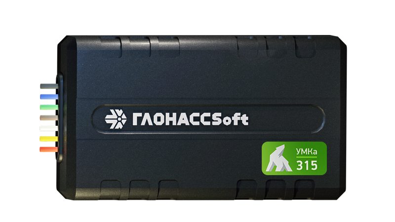

# GLONASSsoft - UMKa315

The UMKa315 is a compact, Plaspy compatible GPS tracker designed for reliable vehicle and asset monitoring. Combining a 32-channel GLONASS/GPS receiver, built-in antennas, Bluetooth Low Energy \(BLE\) identification capability and intelligent power management, the UMKa315 delivers consistent navigation performance and low data consumption—ideal for fleet management, anti-theft protection and telemetry applications.

The UMKa315 is built for easy integration with Plaspy: it transmits packetized telemetry using the Wialon Combine binary protocol and supports EGTS, enabling efficient real-time tracking and detailed sensor data without excessive GPRS traffic. Its small black box form factor, integrated battery and flexible I/O make it a practical choice for mixed fleets, trailers and high-density asset deployments.

## Key Highlights

- Plaspy compatible tracker with Wialon Combine binary protocol and EGTS support for low-traffic, high-frequency telemetry.
- Compact form factor \(39×69×15 mm\) and light weight \(55 g\) for discreet installation on vehicles and assets.
- Integrated BLE interface supports BLE identification and connection to Bluetooth sensors and beacons.
- Intelligent power management and 250 mAh backup battery enable hot start and fail-safe navigation during power events.
- Multiple inputs and outputs \(1 analog input, 3 discrete inputs, 1 digital output, optional RS-485\) for ignition, door or alarm monitoring and remote actions.
- 32-channel GLONASS/GPS receiver for reliable position fixes under varied conditions.
- Built-in antennas and a black box memory store up to 10,000 entries for offline logging and post-event analysis.

## How It Works with Plaspy

The UMKa315 sends compact binary packets using the Wialon Combine protocol and supports EGTS, which together reduce GPRS traffic while preserving high update frequency and rich telemetry. Plaspy-compatible integration means the platform can consume location, sensor and event data for real-time tracking, alerts and reporting.

- Real-time location and telemetry updates: GNSS fixes and accelerometer-derived movement data are transmitted at configurable intervals.
- Inputs for ignition/door/alarm status: discrete inputs can be mapped in Plaspy to show ignition on/off, door open events or other digital signals.
- Fuel monitoring and analog sensors: the analog input supports connection to fuel sensors or other analog telemetry devices when configured.
- Remote immobilizer: the digital output can be used to trigger immobilization or other remote control functions through Plaspy’s command interface \(when customer wiring and configuration permit\).
- Bluetooth sensors and BLE identification: BLE supports proximity-based identification and external sensors for temperature, humidity or presence when paired and managed via Plaspy.

## Technical Overview

| Model | UMKa315 |
| --- | --- |
| GNSS | GLONASS/GPS, 32 receiver channels |
| Communication Standard | GSM 850/900/1800/1900 |
| Connectivity & Protocols | GPRS, Wialon Combine binary protocol, EGTS |
| Interfaces | RS-485 \(optional\), Bluetooth \(BLE\) |
| Analog inputs | 1 |
| Discrete inputs | 3 |
| Digital outputs | 1 |
| Antennas | Built-in |
| Accelerometer | Yes |
| Black box memory | Up to 10,000 entries |
| SIM cards | 1 |
| Control interfaces | SMS, GPRS, Bluetooth |
| Battery | 250 mAh \(built-in\) |
| Intelligent power management | Yes \(hot start, power error protection\) |
| Additional power supply | No |
| Dimensions \(including mounting\) | 39 × 69 × 15 mm |
| Weight | 55 g |

## Use Cases

- Fleet management: real-time tracking and telemetry for small to medium vehicle fleets where compact, low-traffic devices reduce connectivity costs.
- Anti-theft and remote immobilization: use discrete inputs and the digital output to detect unauthorized access and execute immobilizer commands through Plaspy.
- Telemetry and fuel monitoring: connect analog sensors for fuel level monitoring and send efficient telemetry packets to Plaspy for consumption reporting and alerts.
- BLE identification and sensor networks: pair BLE beacons or temperature sensors for driver ID, refrigerated trailer monitoring or proximity-triggered events.
- Asset tracking with offline logging: built-in black box stores up to 10,000 entries for post-event reconstruction when connectivity is intermittent.

## Why Choose This Tracker with Plaspy

The UMKa315 offers a balanced mix of compact hardware, efficient telemetry and practical I/O that make it well suited for Plaspy-based deployments. Its support for Wialon Combine binary protocol and EGTS minimizes GPRS traffic while maintaining high-frequency updates, making it cost-effective for fleet management and continuous real-time tracking. The built-in BLE enables Bluetooth sensors and identification workflows, and the device’s intelligent power management and backup battery help ensure navigation continuity during power interruptions—important for anti-theft scenarios and reliable telemetry.

For integrators and fleet operators seeking a Plaspy compatible GPS tracker that supports ignition monitoring, immobilizer control, fuel monitoring via analog input and BLE sensor ecosystems, the UMKa315 provides a compact, factory-controlled solution with multi-stage quality checks. Its versatile interfaces \(optional RS-485, BLE\), offline black box and low-traffic packet model make it a practical choice for scalable, secure deployments where reliability and efficient data usage matter.

