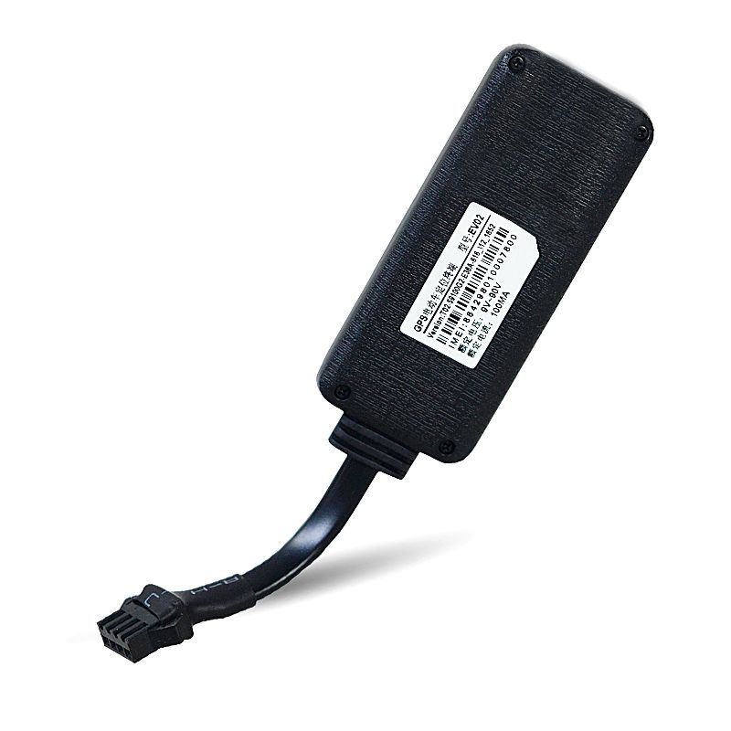

# Goome - EV02

The Goome EV02 is an electric motor positioning terminal designed for the electromobile and motorcycle market. It combines GPS positioning with GSM and GPRS connectivity to provide real time location reporting, trace playback, and user defined geo fences. Its compact size and built in antenna make it suitable for discreet installation on small vehicles where space and concealment are priorities.

As a Plaspy compatible device, the EV02 can provide vehicle visibility and basic tracking features within the Plaspy platform. Plaspy can receive the EV02 position and event data to display live location, review historical traces, and drive alerts and reporting workflows that fleet managers and vehicle owners rely on for security and operations oversight.

## Key Highlights

- Designed for electromobiles and motorcycles with a compact form factor for discreet placement
- GSM GPRS GPS connectivity for continuous position reporting and communication
- Real time tracking for live vehicle visibility and monitoring
- User defined geo fence support to trigger area based alerts
- Trace playback for historical route review and analysis
- Built in antenna for consistent signal reception in common vehicle installations

## How It Works with Plaspy

When integrated with Plaspy, the EV02 supplies location and event information that Plaspy uses to present maps, alerts, and historical reports. Plaspy leverages the tracker data to give operators a consolidated view of vehicle activity alongside other assets in the fleet.

- Live location display on Plaspy maps for immediate situational awareness
- Historical trace playback inside Plaspy for route review and verification
- Geo fence alerting routed through Plaspy to notify teams of area entry or exit
- Fleet level visibility and grouping for operational oversight and dispatch
- Reporting and exportable history to support audits and usage analysis

## Typical Use Cases

- Anti theft monitoring for electric scooters and motorcycles
- Fleet visibility for small delivery and shared mobility services
- Route review and driver behavior analysis using trace playback
- Per vehicle area control using geo fence alerts
- Remote monitoring for rental and lease fleets of two wheeled vehicles

## Why Choose This Tracker with Plaspy

The EV02 offers a focused feature set aimed at electric two wheeled vehicles where compact size and reliable positioning are important. Paired with Plaspy, the tracker fills common requirements for anti theft protection, live location visibility, and historical route review without adding unnecessary complexity.

For organizations managing scooters, motorcycles, or small electromobiles, the EV02 provides a straightforward option to feed location and event data into Plaspy. The combination supports operational monitoring, alerting, and reporting workflows that help keep fleets secure and better managed.

To learn more about how Plaspy can work with compatible trackers like the Goome EV02 visit https://www.plaspy.com. Product specifications, availability, and manufacturer details can change over time so please verify current technical information on the official manufacturer site http://www.goomegpstracker.com.
