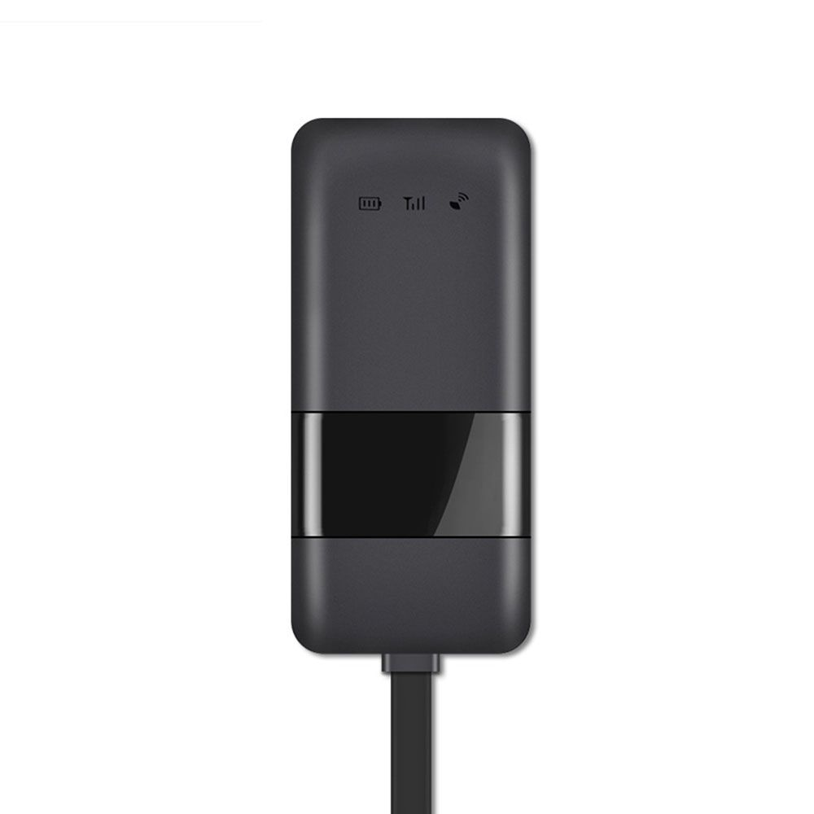

# Goome - GM02G

The Goome GM02G GPS tracker is a compact and easy-to-install device designed to provide real-time tracking for your vehicle. With its smaller size, it can be discreetly placed inside the car, allowing for seamless monitoring without drawing attention. Simply connect the power and the tracker will start working immediately.

One of the standout features of the GM02G is its support for anti-spy technology and sleep function. This means that the device will connect to the server at preset times and when the vehicle is in motion, ensuring that you always have access to accurate and up-to-date tracking information.

The GM02G offers a range of impressive features to enhance your tracking experience. With real-time tracking, you can monitor the location of your vehicle in real-time, giving you peace of mind and the ability to react quickly if necessary. The user-defined Geo-fence feature allows you to set up virtual boundaries for your vehicle, and you will receive alerts if the vehicle enters or exits these boundaries.

The GM02G also includes trace playback, allowing you to review the historical movement of your vehicle. ACC detection enables you to monitor the status of the vehicle's ignition, while over-speed and cut wire alarms provide additional security measures. The device is also waterproof, ensuring its durability in various weather conditions. Vibration alarms further enhance the security of your vehicle, alerting you to any unauthorized movement or tampering.

With its built-in acceleration sensor, the GM02G can detect sudden changes in speed or direction, providing you with valuable information about the driving behavior of the vehicle. Additionally, the device offers real-time tracking remotely controlled through a web and app tracking platform, giving you the flexibility to monitor your vehicle from anywhere, at any time.

In summary, the Goome GM02G GPS tracker is a reliable and feature-packed device that offers real-time tracking, user-defined Geo-fence, trace playback, ACC detection, over-speed and cut wire alarms, waterproof design, vibration alarms, and more. With its compact size and easy installation, it is an excellent choice for anyone looking to enhance the security and monitoring of their vehicle.

