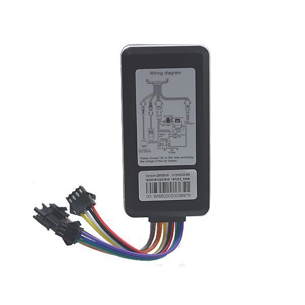

# Goome - GM06NW

The Goome GM06NW is a compact vehicle GPS tracker that combines GPS positioning and GSM connectivity to deliver reliable location tracking. It includes a built in antenna and onboard sensors with features such as ACC detection, vibration alarm, and the ability to cut off fuel or electricity remotely. The device also supports an SOS button and microphone for emergency notification and ambient listening when configured, and its wide input voltage range makes it suitable for cars, trucks, taxis, and motorcycles.

As a Plaspy compatible device, the GM06NW can feed location and event data into Plaspy for centralized monitoring and reporting. Plaspy can use the tracker’s real time tracking, geo fence notifications, tracking playback, and alarm signals to provide operational oversight across fleets or individual vehicles. This compatibility makes the GM06NW a practical option for organizations that want to combine device level features with Plaspy’s tracking and management tools.

## Key Highlights

- Real time vehicle tracking for continuous location visibility
- Geo fence capability with enter and exit alerts for defined zones
- Tracking playback to review historical routes and events
- ACC detection and vibration alarm for movement and tamper awareness
- Remote power or electricity cut off for theft response and control
- SOS button support and microphone based audio monitoring for emergencies
- Compact form factor and wide input voltage range for diverse vehicle types

## How It Works with Plaspy

When the GM06NW is connected to Plaspy, its location updates and alarm events become part of Plaspy’s fleet monitoring environment. Plaspy consolidates those inputs to present live maps, alerting, and historical reports so operators can make timely decisions and maintain situational awareness.

- Display real time location on Plaspy live maps for single vehicles or whole fleets
- Configure geo fence rules in Plaspy and receive notifications when the GM06NW crosses boundaries
- Replay historical tracks in Plaspy for route verification and incident review
- Surface vibration and ACC events as alerts to detect potential theft or unauthorized movement
- Log SOS activations in Plaspy and include emergency events in operator workflows
- Use Plaspy reporting to summarize device activity for audits and operational analysis

## Typical Use Cases

- Fleet management for small to medium commercial vehicle operations
- Taxi and rideshare monitoring to track trips and ensure safety
- Motorcycle and scooter tracking where compact devices are required
- Theft prevention and recovery with remote immobilization and alarm signals
- Personal safety and emergency response using SOS alerts and audio monitoring

## Why Choose This Tracker with Plaspy

The GM06NW provides a balanced feature set for vehicle tracking that aligns with common fleet and safety requirements. Its combination of location tracking, alarm signals, geo fencing, and remote cut off functions makes it suitable for organizations that need practical control and oversight without complex device management. Paired with Plaspy, the device’s events and location data can be presented in a unified dashboard for operators to act on.

If your operational needs include real time visibility, simple geofence workflows, historical route review, and basic emergency signaling, the GM06NW is worth considering as a Plaspy compatible option. For full technical specifications and the latest product details, learn more about Plaspy on the main website https://www.plaspy.com and verify current manufacturer information at the official Goome site http://www.goomegpstracker.com. Product specifications, availability, and manufacturer details can change over time, so please consult the manufacturer documentation for the most current information.
