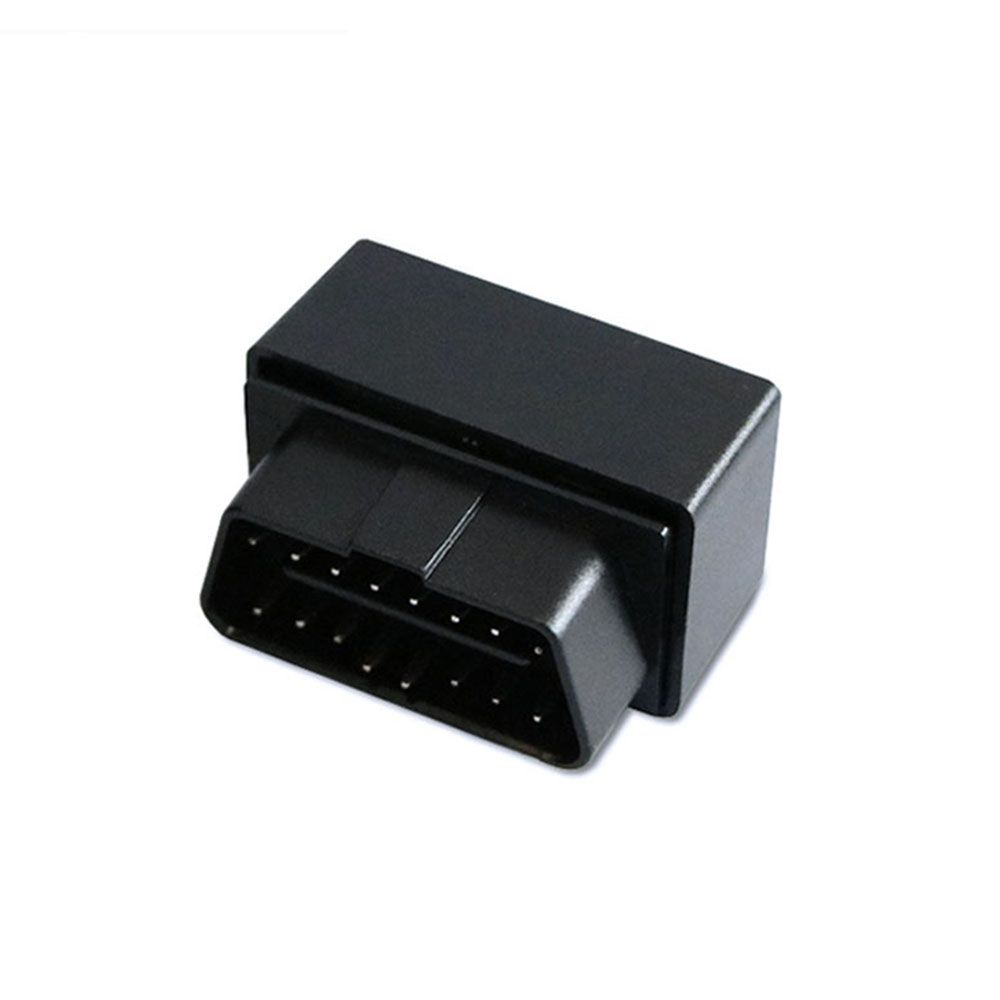

# Goome - GMOBD

The Goome GMOBD is a GPS tracker that is based on OBD2 technology and comes with a built-in GSM module and BDS/GPS module. This tracker is designed to provide a range of features including anti-theft, remote listening, alarm, tracking, and position functions. It is suitable for various applications such as car rental, small fleet management, and dispatching systems where the vehicle cannot be online after restarting the equipment manually.

One of the standout features of the Goome GMOBD is its real-time tracking capability, allowing you to monitor the location of your vehicle in real-time. It also offers user-defined geo-fencing, which enables you to set up virtual boundaries and receive alerts when the vehicle enters or exits those boundaries. Additionally, the tracker supports trace playback, allowing you to review the historical routes taken by the vehicle.

The Goome GMOBD is compatible with any 16-pin OBD interface cars, making it easy to install and use. It also comes with a power-off alarm feature, which notifies you if the tracker is disconnected from the power source. The tracker is compact in size and features a vibration alarm, providing added security for your vehicle. It is also equipped with a built-in acceleration sensor and has a waterproof design, ensuring its durability and reliability in various conditions.

With the Goome GMOBD, you can enjoy real-time tracking and remotely control the tracker through a web and app tracking platform. It also comes with a backup battery, ensuring continuous tracking even if the power source is disconnected. Overall, the Goome GMOBD is a versatile and feature-rich GPS tracker that offers a range of functions for vehicle monitoring and security.

