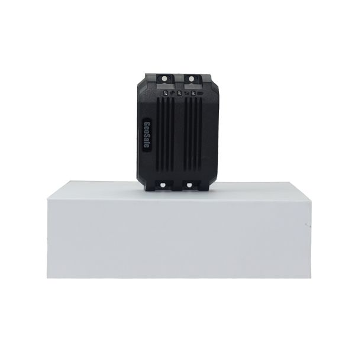

# Goome - U9

The Goome U9 is a compact, high end GPS tracking device built around u blox 7 and fourth generation GPS technology. It supports multiple location modes including GPS, LBS, and AGPS, with automatic fallback to LBS when satellite signals are weak. Despite its small footprint, the U9 offers a broad feature set such as real time tracking, user defined geo fencing, trace playback, SOS alert, vibration alarm, cut wire alarm, remotely triggered voice monitoring, and the ability to connect to a relay for engine cutoff.

As a Plaspy compatible device, the U9 can be integrated into a fleet and asset management workflow to provide consistent location visibility and event alerts. Plaspy can bring the U9 data into a unified interface for monitoring, reporting, and operational oversight, helping organizations use the U9 features — like geofencing alerts and SOS events — within a broader tracking platform.

## Key Highlights

- Accurate positioning based on u blox 7 and fourth generation GPS technology
- Multiple location modes with automatic fallback to LBS when GPS is unavailable
- Compact form factor that fits discreet installations without sacrificing features
- Remote engine cutoff capability via relay for added asset control
- Built in safety and security features including SOS button, vibration alarm, and cut wire alarm
- Support for trace playback and remote voice monitoring to aid investigations and verification

## How It Works with Plaspy

The U9 feeds location and event data into Plaspy where that information is presented alongside other devices for centralized management. Plaspy translates the U9 signals into map views, alerts, and reports so teams can act on position updates and configured events.

- Real time location visibility of U9 equipped assets on Plaspy maps
- Configurable alerts for geofence entries and exits, SOS triggers, and tamper events
- Historical trace playback for route review and incident analysis
- Consolidated reporting for fleet performance and location history
- Operational oversight features such as grouped device views and status summaries

## Typical Use Cases

- Vehicle fleet management where compact reliable trackers are needed
- Protection of high value assets that require geofencing and tamper alerts
- Rental and shared vehicle monitoring including remote disable options
- Logistics and delivery tracking for route verification and playback
- Personal safety or lone worker tracking with SOS alerting

## Why Choose This Tracker with Plaspy

The Goome U9 is a practical choice for organizations that need a compact device with dependable positioning and a range of security features. Its multiple location modes and automatic fallback behavior help maintain tracking continuity in challenging signal environments, while capabilities like remote relay control add a useful layer of operational control when integrated into a management platform.

When paired with Plaspy, the U9 becomes part of a larger monitoring and reporting workflow, enabling teams to use alerts, playback, and consolidated views to improve response times and operational awareness. For users who value a small device footprint combined with the functionality needed for fleet and asset oversight, the U9 with Plaspy integration provides a balanced option.

To learn more about Plaspy and how the Goome U9 can fit into your tracking strategy visit https://www.plaspy.com. Product specifications, availability, and manufacturer details can change over time, so please verify current specifications on the manufacturer's official website http://www.goomegpstracker.com.
