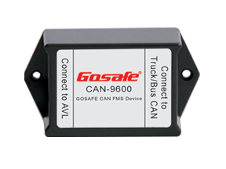

# Gosafe - CAN-9600

The Gosafe CAN-9600 is a specialized GPS tracking accessory designed to read FMS data from trucks and buses. It accepts FMS output from vehicle systems using standard CAN protocols and provides that data through an SMS serial interface to downstream devices. The unit is intended to capture vehicle operational information from the FMS port and transmit it over a serial link so that the information can be forwarded to a tracking system.

As a Plaspy compatible device, the CAN-9600 can be used to bring FMS data into the Plaspy platform alongside location and fleet context. Gosafe reports integration between the CAN-9600 and their GPS trackers, enabling collected FMS information to be relayed back to a server for web access. For fleets that require vehicle data in addition to position tracking, the CAN-9600 provides a practical bridge to feed that information into Plaspy for monitoring and reporting.

## Key Highlights

- Purpose built to read FMS data from trucks and buses for fleet telematics
- Works with standard vehicle CAN based FMS outputs SEA J1939 and SEA J1708
- Outputs collected data to a serial RS232 interface for downstream devices
- Designed for easy integration with GPS trackers and tracking systems
- Known to interoperate with Gosafe tracker models such as the G6S and G92I
- Enables sending FMS information back to a server for centralized access

## How It Works with Plaspy

When connected to a compatible GPS tracker or serial gateway, the CAN-9600 forwards FMS information so Plaspy can present it alongside vehicle location and historical trips. This enables fleet managers to view operational data in the same platform used for tracking and oversight.

- Consolidate FMS telemetry with position data inside Plaspy for unified fleet views
- Use Plaspy dashboards and reports to analyze vehicle operational trends over time
- Combine FMS input with location history to support utilization and routing analysis
- Trigger general alerts or notifications in Plaspy based on vehicle data thresholds
- Archive FMS records in Plaspy for compliance reporting and operational review

## Typical Use Cases

- Fleet operators collecting FMS data from trucks and buses for centralized monitoring
- Combining vehicle operational data with GPS tracking for performance analysis
- Sending FMS information to a server for reporting and historical record keeping
- Integrating with existing Gosafe trackers to extend telemetry captured from vehicles
- Providing fleet managers with additional visibility into vehicle status alongside location

## Why Choose This Tracker with Plaspy

The CAN-9600 is a focused solution for fleets that need to extract FMS data from heavy vehicles and make it available to tracking platforms. Its role is to translate vehicle FMS output into a serial stream that compatible GPS devices and servers can consume, which makes it a useful addition where operators want FMS visibility without changing their core tracking infrastructure.

Paired with Plaspy, the CAN-9600 helps bring vehicle operational data into a single platform for monitoring, reporting, and operational oversight. If your fleet requires FMS level information in addition to position tracking, the CAN-9600 is a practical component to consider alongside Plaspy enabled trackers and server workflows.

To learn more about how Plaspy supports fleet telemetry and device integrations, visit https://www.plaspy.com. Product specifications and availability can change over time, so please verify current technical details and manufacturer documentation at https://gosafesystem.com/ before making procurement or deployment decisions.
