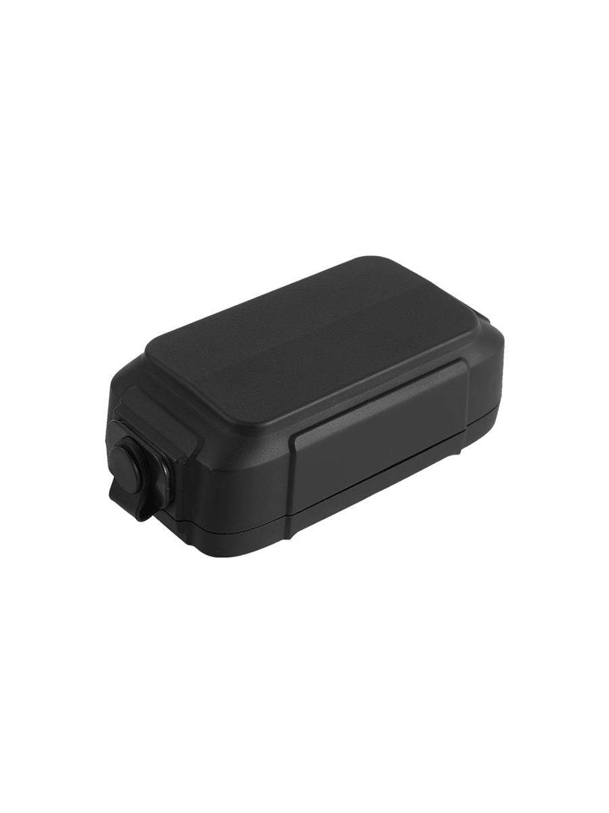

# Gosafe - G1RUS

The G1RUS is a purpose built GPS tracker designed for long unattended deployments on trailers, containers and other high value assets. It combines an extremely low power hardware platform with a rugged enclosure and flexible power options so managers can deploy reliable location and telemetry solutions that run for months or years without frequent maintenance. The device is intended for coarse and fine asset visibility where durability and long battery life are primary requirements.

As an out of the box Plaspy compatible device, G1RUS provides the core location and telemetry data Plaspy needs for geofencing, route management, anti theft alerts and telemetry based workflows. Its combination of long runtime, configurable inputs and optional sensor connectivity makes it straightforward to incorporate G1RUS into Plaspy for continuous monitoring, alerts and historical reporting across fleets and dispersed assets.

## Key Highlights

- Purpose built for long unattended deployments on trailers containers and high value assets
- Extremely low power design with replaceable battery and optional rechargeable pack for multi month or multi year operation
- Rugged enclosure and multiple mounting options suitable for outdoor and intermodal use
- GNSS based location with assisted positioning for reliable fixes and timely reporting
- Multiple communications modes and variant options to match network availability and deployment needs
- Configurable digital I/O and optional Bluetooth sensor support for telemetry and auxiliary monitoring
- Remote management features such as firmware update over the air and conditional reporting profiles

## How It Works with Plaspy

G1RUS transmits position and telemetry in formats that Plaspy accepts, enabling real time tracking as well as historical playback and reporting. Plaspy consumes GNSS fixes, movement events and input statuses to build maps, alerts and operational dashboards. Conditional reporting profiles help preserve battery life while still delivering the timely data Plaspy users need for oversight.

- Real time location updates and telemetry for live fleet visibility and mapping
- Low power conditional reporting based on time speed or events to extend battery life while preserving useful data
- Geofences and waypoints support for route validation delivery tracking and zone alerts
- Device status and diagnostics reporting to show battery condition power input and basic health indicators
- Optional Bluetooth sensor integration to surface temperature door or proximity signals alongside GPS data
- Remote provisioning and firmware updates to manage large deployments without physical access

## Typical Use Cases

- Trailer and container tracking where long unattended operation and rugged mounting are required
- Delivery and route management using waypoints and time or speed based geofences to validate stops
- Asset anti theft and recovery workflows with movement alerts and immediate location reporting
- Environmental and condition monitoring by pairing optional sensors to report temperature or open door events
- Seasonal or parked equipment monitoring that benefits from low maintenance long life tracking

## Why Choose This Tracker with Plaspy

G1RUS is well suited to organizations that need durable, low maintenance asset tracking integrated into Plaspy. Its focus on low power consumption, flexible power strategies and rugged packaging matches common Plaspy deployments for trailers containers and dispersed equipment where maintenance visits are expensive or infrequent. The available telemetry inputs and optional sensor support allow teams to extend basic location tracking into richer status and event driven workflows.

While the device does not include dedicated fuel probes or immobilizer hardware out of the box, its configurable inputs and optional Bluetooth module make it straightforward to integrate fuel monitoring ignition detection or immobilizer workflows in Plaspy when paired with appropriate external sensors or vehicle interfaces. If you want to learn more about Plaspy and how it can manage G1RUS devices at scale visit https://www.plaspy.com. Product specifications availability and manufacturer details can change over time so please verify current specifications and options on the official manufacturer site https://gosafesystem.com/.
