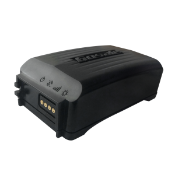

# Gosafe - G1S

The Gosafe G1S is a portable GPS tracker that offers a unique design and power standard, making it a versatile option for users. One of the standout features of the G1S is its ability to use either replaceable or rechargeable batteries, giving users the flexibility to choose the power source that best suits their needs. 

When using replaceable CR123 batteries, the G1S has a total capacity of 6000mAh, providing enough power to send one message per day for up to three years. This makes it an ideal choice for long-term tracking applications where regular battery replacement may not be feasible. Additionally, the G1S can also be powered by rechargeable batteries and can be conveniently charged via an external power connector.

With its portable design, the G1S is easy to carry and can be used in a variety of tracking scenarios. Whether you need to keep tabs on a vehicle, a valuable asset, or even a loved one, the G1S offers reliable and accurate GPS tracking capabilities. Its compact size and durable construction make it suitable for both indoor and outdoor use, ensuring that you can track your assets or loved ones with peace of mind.

Overall, the Gosafe G1S is a portable GPS tracker that combines convenience, versatility, and reliability. With its unique power options and durable design, it is an excellent choice for anyone in need of a portable tracking solution.

