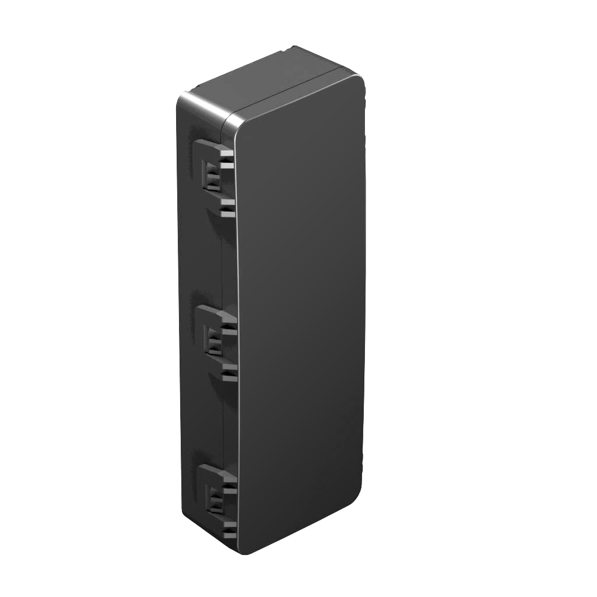

# Gosafe - G2C-DB

The G2C-DB is a rugged, long life GPS tracker designed for long term asset monitoring of trailers, containers and remote equipment. It combines multi constellation positioning with optimized power management and a replaceable 9000 mAh battery pack to deliver years of standby operation. Built for harsh environments, the device includes waterproofing, shock and vibration resilience and store and forward memory to preserve event continuity in intermittent coverage.

As a Plaspy compatible tracker, the G2C-DB integrates location fixes, movement telemetry and device health data into the Plaspy platform. Its configurable reporting modes — periodic, movement based and active tracking — make it suitable for both low maintenance oversight and more frequent updates when workflows in Plaspy require higher reporting cadence.

## Key Highlights

- Long life operation from a replaceable 9000 mAh battery pack for minimal maintenance over long deployments
- Plaspy compatible for consolidated fleet management and reporting across mixed device fleets
- Multi constellation GNSS positioning for improved location reliability in open sky environments
- Rugged design with waterproof rating and shock resilience for harsh operating conditions
- Flexible reporting modes including periodic, movement based and configurable active tracking
- On device store and forward memory and motion telemetry to preserve events during coverage gaps

## How It Works with Plaspy

When connected, the G2C-DB delivers position fixes, motion events and device status to Plaspy where the data is ingested, normalized and presented for fleet monitoring and reporting. Administrators can tune reporting behavior to balance the need for real time visibility with long battery life, and use Plaspy tools for alerts, historical review and operational oversight.

- Configurable location reporting frequency for near real time tracking or low duty long term monitoring
- Movement and tamper alerts derived from on device motion detection for anti theft monitoring
- Store and forward memory ensures event logging and later delivery when the device regains connectivity
- Battery state and device health reporting to support scheduled maintenance and unattended asset programs
- Remote firmware updates and configuration via supported over the air channels to simplify fleet upkeep

## Typical Use Cases

- Long term trailer and container tracking where periodic checks and minimal maintenance are priorities
- Remote equipment monitoring for construction, agriculture and rental fleets to detect unauthorized use
- Anti theft and security workflows using motion alerts plus resilient data delivery after coverage loss
- Asset inventory and periodic location audits across dispersed logistics yards and depots
- Low maintenance fleet oversight for assets that require years of standby operation between service visits

## Why Choose This Tracker with Plaspy

The G2C-DB offers a practical mix of durability, long battery life and reliable positioning that complements Plaspy deployments for asset centric fleet operations. Its focus on low maintenance operation and resilient event logging makes it a strong candidate for organizations that need long term visibility without frequent site visits. When integrated with Plaspy, the tracker’s data can be combined with other telemetry sources and reporting workflows to provide unified operational insight.

Learn more about using Plaspy with compatible trackers on https://www.plaspy.com. Product specifications and availability can change over time, so verify current technical details and regional model options on the manufacturer site https://gosafesystem.com/.
