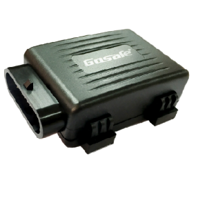

# Gosafe - G3A

The Gosafe G3A is a compact and powerful GPS tracker that offers a range of advanced features in a small package. Despite its small size, this device is packed with functionality and is perfect for a variety of tracking applications. Powered by an internal backup battery, the G3A ensures continuous tracking even in the event of a power outage. 

One standout feature of the G3A is its GSM jamming detection system. This innovative technology allows the tracker to detect and alert you to any attempts to interfere with the GPS signal. This ensures that you always have accurate and reliable tracking data, even in challenging environments. 

The G3A also offers multiple I/O options, including distance, change course, time, and event upload modes. This flexibility allows you to customize the tracker to suit your specific tracking needs. Additionally, the G3A can be easily connected to a microphone and various analog inputs, expanding its functionality even further. 

Designed with an internal 2D accelerometer, the G3A provides accurate and reliable motion detection. This allows you to monitor not only the location of the tracker but also any movement or changes in position. Whether you need to track vehicles, assets, or even people, the G3A is a versatile and reliable choice. 

Outstanding features of the Gosafe G3A GPS tracker include:
- Compact and lightweight design
- Internal backup battery for continuous tracking
- GSM jamming detection system for reliable signal
- Multiple I/O options for customization
- Easy connection to microphone and analog inputs
- Internal 2D accelerometer for accurate motion detection

With its impressive features and compact size, the Gosafe G3A is an excellent choice for anyone in need of a reliable and versatile GPS tracker.

