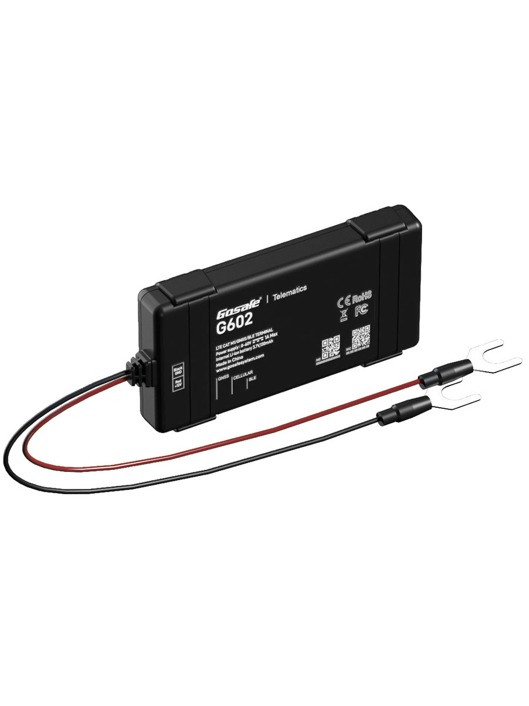

# Gosafe - G602

The Gosafe G602 Easy Install is a compact two wire GPS tracker built for rapid deployment and robust fleet telematics. It delivers high sensitivity real time tracking, crash telemetry and driver behavior data in a package designed to be fitted quickly across large vehicle fleets. The G602 combines multi GNSS positioning with an accelerometer driven crash recorder and cellular communications to provide continuous vehicle location and event streams.

As a Plaspy compatible device, the G602 can feed location, event and sensor data directly into Plaspy for monitoring, alerts and analytics. Its out of the box compatibility and plug friendly design make it a practical choice when you need to add vehicles to a Plaspy managed fleet quickly while retaining access to rich telemetry for safety, insurance and operational reporting.

## Key Highlights

- Two wire plug and play installation designed for fast fit and scale across fleets.
- Plaspy compatible for consistent real time tracking and telemetry delivery.
- High sensitivity multi GNSS engine for reliable positioning in typical vehicle environments.
- Crash ready telemetry with a 3D accelerometer and high rate crash recording for incident detection.
- BLE 4.2 support to extend telemetry with external sensor readings such as temperature or door status.
- Wide vehicle voltage tolerance and configurable power modes for diverse fleet vehicles.
- Global LTE Cat 1 connectivity with GPRS fallback and multiple reporting paths for robust data delivery.

## How It Works with Plaspy

The G602 streams position, event and sensor information to Plaspy using standard cellular transports and text reporting where needed. Plaspy ingests the incoming telemetry to present live locations, trigger alerts and build historical reports that support operational oversight and insurer workflows.

- Real time location and movement updates delivered into Plaspy for live tracking and route visibility.
- High rate crash and impact reporting forwarded to Plaspy to support incident alerts and reconstruction.
- Virtual ignition and status events mapped to vehicle records for on off state monitoring in Plaspy.
- Geofence and rule events generated by the device can trigger Plaspy alerts and automated reporting.
- BLE sensor readings are passed through to Plaspy to add temperature, door or other external sensor context.
- Remote firmware updates and device management coordinated alongside Plaspy fleet operations.

## Typical Use Cases

- Fleet management for live vehicle location, route verification and driver behavior monitoring.
- Insurance telematics programs needing crash data and driving metrics for claims and risk analysis.
- Anti theft and recovery with continuous tracking and geofence alerts to support quick response.
- Dispatch and operations where real time position and status improve routing and customer service.
- Sensor augmented assets combining external sensor data with position for condition monitoring.

## Why Choose This Tracker with Plaspy

The G602 Easy Install is a practical fit for organizations using Plaspy when rapid deployment and rich telemetry are priorities. Its compact, two wire design reduces installation time while the combined GNSS positioning, crash recording and external sensor support provide the kind of event and location data Plaspy uses for alerts, analytics and reporting.

Learn more about Plaspy and how compatible devices like the G602 fit into fleet and telematics programs at https://www.plaspy.com. Product specifications and availability can change over time, so please verify current details and documentation with the manufacturer at https://gosafesystem.com/.
