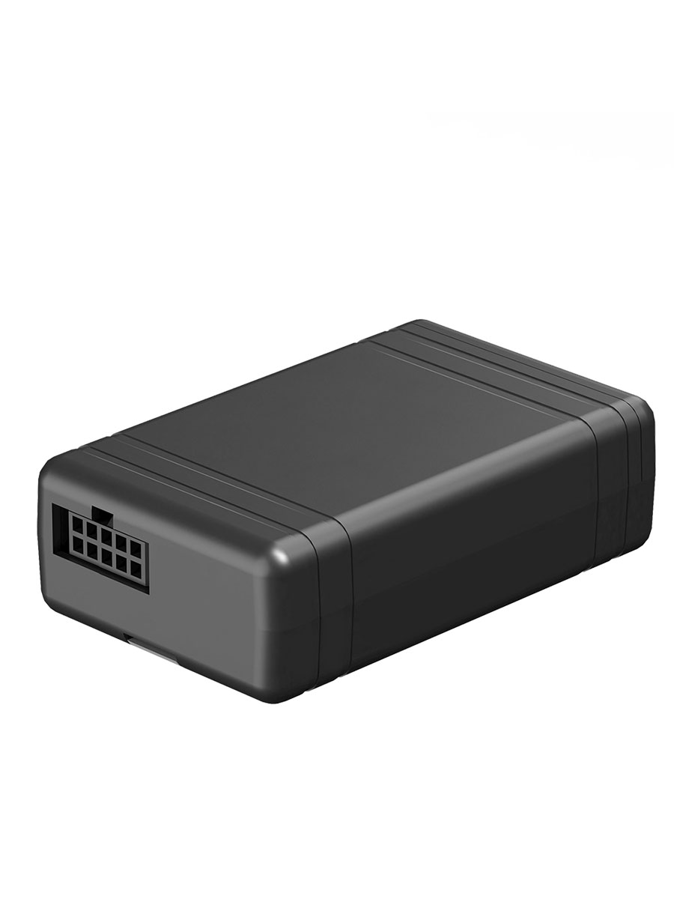

# Gosafe - G610

The G610 is a compact, cost conscious vehicle tracker built for service providers, integrators and enterprise fleets that need reliable Plaspy compatible hardware. It combines cellular connectivity, multi constellation GNSS position fixing and wireless sensor support to deliver continuous location, event and crash telemetry suitable for fleet management and insurance telematics programs.

As a device described as designed for easy integration with Plaspy, the G610 supports standard reporting modes, remote firmware updates and built in geo fence capabilities that simplify large scale deployments. Plaspy can ingest the G610 telemetry to provide live mapping, alerts, historical reporting and the operational tools fleet managers rely on for dispatch, recovery and driver behavior analysis.

## Key Highlights

- Plaspy compatible LTE Cat 1 tracker with fallback modes for consistent real time tracking and fleet oversight.
- Multi constellation GNSS positioning for improved accuracy in a range of environments.
- High resolution crash recording and frequent GPS updates to support driving behavior analysis and incident reconstruction.
- Flexible inputs and outputs for ignition sensing, status monitoring and anti theft workflows.
- BLE and Wi Fi support to extend telemetry with wireless sensors and supplement GNSS positioning.
- Low power operational modes and optional backup battery support to reduce data gaps during power loss.
- FOTA firmware updates and common reporting modes to ease remote management and large fleet provisioning.

## How It Works with Plaspy

When integrated with Plaspy, the G610 reports position fixes, event states and sensor readings so operators gain continuous visibility and actionable alerts. Plaspy receives telemetry from the G610 and converts that data into live maps, automated notifications and historical reports for operational decision making.

- Continuous location updates and route replay for dispatch and monitoring.
- Input and ignition state reporting to track vehicle usage and support telematics workflows.
- High frequency accelerometer and crash logs forwarded to Plaspy for incident analysis.
- Wireless sensor data from BLE devices and supplemental Wi Fi location aiding asset condition monitoring and indoor positioning.
- Remote control workflows using device outputs for immobilization or other response actions configured within Plaspy.

## Typical Use Cases

- Fleet anti theft and rapid recovery combining live tracking and output controlled immobilization.
- Vehicle telematics and driver behavior monitoring using high resolution GPS and accelerometer records.
- Service dispatch and route optimization using accurate location and ignition status feeds.
- Sensor based monitoring for temperature sensitive loads or asset condition tracking via BLE sensors.
- Insurance telematics programs that require crash recording and historical driving behavior for claims support.

## Why Choose This Tracker with Plaspy

The G610 pairs practical hardware features with standard reporting modes that make it a sensible option for organizations using Plaspy. Its combination of reliable cellular connectivity, multi constellation GNSS and flexible I O provides the core telemetry needed for real time fleet management, anti theft measures and telematics reporting without imposing complex integration requirements.

If you want a compact, enterprise focused tracker that aligns with Plaspy workflows for live visibility, alerts and historical analysis, the G610 is a relevant choice to evaluate. Learn more about Plaspy on the main website https://www.plaspy.com and note that product specifications, availability and manufacturer details can change over time so verify current technical information on the official Gosafe documentation site https://gosafesystem.com/
