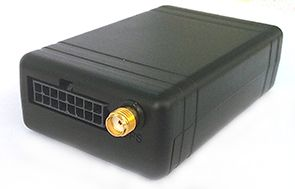

# Gosafe - G6S

The Gosafe G6S is a GPS tracker built for service providers, integrators, and enterprise customers. It is designed to improve mobile resource management and dispatch systems, making it well suited for fleet management, insurance telematics, vehicle location and recovery, and similar operational scenarios. The device uses quad band GSM GPRS tracking with a 3G option available, and includes features aimed at reliable position reporting and operational oversight.

As a Plaspy compatible device, the G6S can be integrated into Plaspy's fleet and asset management workflows to provide centralized visibility and control. Its over the air device management and FOTA capabilities help reduce field maintenance, while hardware geo fencing and GSM jamming detection bring additional security and alerting options that Plaspy can surface to operators and administrators.

## Key Highlights

- Targeted at service providers, integrators, and enterprise fleet operations
- Quad band GSM GPRS tracking with an available 3G version for wide coverage
- Over the air device management and maintenance to simplify provisioning
- FOTA firmware updates to keep devices current without physical access
- GSM jamming detection for added signal interference awareness
- Support for up to 28 hardware based geo fences for location based alerts
- Practical for dispatch optimization, recovery, and telematics workflows

## How It Works with Plaspy

The G6S sends location and device status information that Plaspy can ingest and present for monitoring, alerting, and reporting. Plaspy leverages the tracker features to provide operational visibility, manage device fleets, and generate the notifications teams need to act quickly.

- Real time vehicle location and status on the Plaspy dashboard
- Geo fence events and notifications for entry and exit alerts
- Alerts for detected GSM jamming surfaced to operators
- Remote device management and update tracking supported through Plaspy workflows
- Historical tracking and reporting for route review and operational analysis

## Typical Use Cases

- Fleet dispatch and daily vehicle operations monitoring
- Insurance telematics and usage based monitoring programs
- Vehicle location and recovery for stolen asset response
- Service and field workforce tracking for logistics and scheduling
- Enterprise asset oversight where centralized device management is required

## Why Choose This Tracker with Plaspy

The Gosafe G6S pairs enterprise oriented hardware features with Plaspy's platform capabilities to support organizations that need reliable tracking, remote device maintenance, and operational alerts. Its over the air management and FOTA support reduce on site maintenance, while hardware geo fences and jamming detection provide security related signals that are useful in fleet and insurance workflows.

For teams evaluating trackers for use with Plaspy, the G6S is a practical option when you need a device aimed at service providers and enterprise deployments and that offers remote management features. If you are considering the G6S for your deployment, Plaspy can help centralize monitoring, alerts, and reporting to support everyday operations.

To learn more about Plaspy, visit https://www.plaspy.com. Product specifications, availability, and manufacturer details can change over time, so verify current specifications on the manufacturer's site https://gosafesystem.com/.
