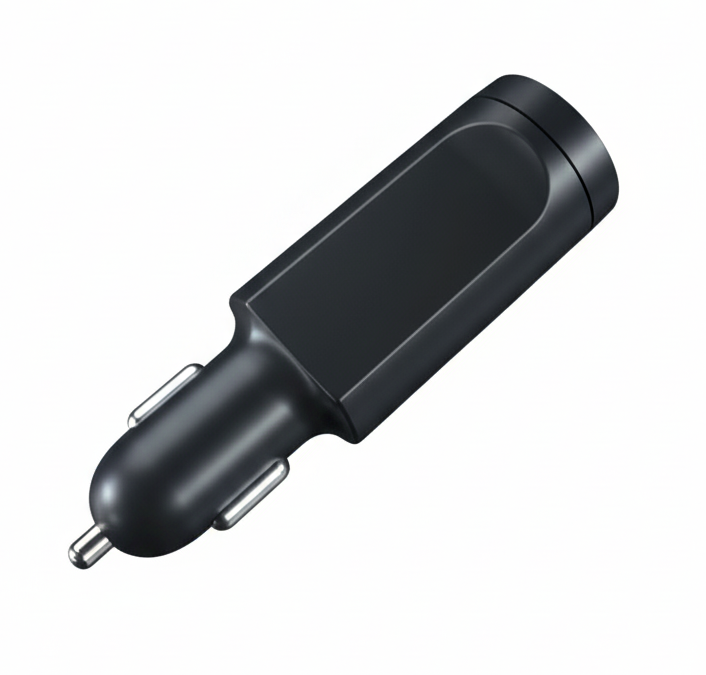

# Gosafe - G717

The Gosafe G717 is a compact, plug-and-play cigarette lighter GPS tracker that’s Plaspy compatible for fast integration into your fleet management or personal-vehicle monitoring setup. Designed for easy installation with no permanent wiring, the G717 delivers real-time tracking, driver behaviour monitoring, and event reporting through TCP/UDP and SMS — making it an ideal GPS tracker for rental cars, leased vehicles, or any operation that needs removable, reliable telemetry.

The G717 combines multi-constellation GNSS positioning, an on-board 16G 3D accelerometer for accident and driving-event detection, and on-board logging to ensure continuous coverage even when cellular connectivity is intermittent. Plaspy users can ingest the G717’s location, speed, and accelerometer events to enable actionable fleet management, anti-theft alerts, and behaviour-based reporting without complex wiring or installation time.

## Key Highlights

- Plug-and-play installation via vehicle cigarette lighter socket — no permanent wiring required for quick deployment and removal.
- Plaspy compatible: real-time tracking and telemetry via TCP/UDP/SMS with IP/domain configuration for platform integration.
- High-precision GNSS: 72-channel receiver with GPS/GLONASS/Galileo/BeiDou and AGPS assistance \(SBAS ~2.0 m CEP\).
- Integrated 3D accelerometer \(16G\) for accident detection, harsh-braking and driving-event reconstruction.
- On-board flash memory \(~4 Mbit, ~8,000 records\) for local logging during connectivity outages.
- Wide voltage range \(8–32V DC\) to support both 12V and 24V vehicle systems and ultra-low power sleep modes for minimal drain.
- Internal SIM access and internal antennas plus mini USB port for configuration and firmware updates.

## How It Works with Plaspy

When connected to Plaspy, the G717 streams location and event data using TCP/UDP and can also send SMS-based updates where data networks are unavailable. Plaspy ingests the device’s telemetry to provide live maps, reports, alerts, and historical playback. IP/domain configuration and device-side settings make onboarding straightforward so you can scale from a single vehicle to a larger fleet quickly.

- Real-time location and telemetry: periodic position updates and event-driven reports delivered to Plaspy via TCP/UDP or SMS.
- Accelerometer events: crash detection, harsh acceleration/braking, and behaviour flags captured by the 16G 3D accelerometer.
- Geo-fence and over-speed alerts: configurable on the device and forwarded to Plaspy for immediate notification.
- Local log replay: on-board flash memory stores up to ~8,000 records for upload to Plaspy after reconnection.
- Simple provisioning: internal SIM access plus IP/domain settings allow centralized configuration for fleet management.

## Technical Overview

| Connectivity | LTE/HSPA/GPRS capable communication; supports TCP/UDP/SMS for data transport |
| --- | --- |
| Bands | Quad-band GSM/GPRS 850/900/1800/1900 MHz; optional 3G dual-band variants \(US/EU\) with HSPA data rates when enabled |
| Power & Battery | Operating voltage 8–32V DC \(12V/24V compatible\); internal Li‑Po 250 mAh backup battery; power modes: ~3 mA sleep, ~33 mA power-save, ~130 mA active tracking at 12V; battery charge range 0 to +45°C |
| Interfaces | Plug-in cigarette lighter connection \(plug-and-play\), mini USB port for configuration/firmware updates, internal SIM access; no permanent wired I/O specified |
| GNSS | Multi-constellation GNSS: GPS/GLONASS/Galileo/BeiDou with AGPS; 72-channel receiver; SBAS accuracy ~2.0 m CEP |
| Bluetooth | Not specified / no Bluetooth sensors indicated |
| Remote Management | IP/domain configuration for server integration; mini USB for firmware/configuration updates \(no FOTA explicitly specified\) |
| Form Factor | Compact lighter-plug design, 108 × 32 × 32 mm, ~55 g \(with battery\), removable for temporary installations |
| Durability & Compliance | Complies with vehicle shock and vibration standards \(SAE J1455\) and EMC/EMI requirements |

## Use Cases

- Fleet management for short-term or seasonal vehicles where non-permanent installation is preferred — fast roll-out, plug-and-play simplicity.
- Rental and leased-vehicle monitoring: track location, mileage trends, and driving behaviour without altering vehicle wiring.
- Vehicle security and anti-theft workflows: use real-time tracking and geo-fence alerts to detect unauthorized movement and support recovery.
- Driver behaviour analysis and insurance telematics pilots: capture accelerometer-driven events and speed data for behaviour-based reporting.
- Temporary deployments for event logistics or project-based vehicles where rapid installation and removal are required.

## Why Choose This Tracker with Plaspy

The Gosafe G717 offers a practical balance of precision GNSS positioning, event-rich telemetry, and hassle-free installation that makes it an excellent Plaspy compatible GPS tracker for operations that value speed of deployment and complete positional insight. Its internal antennas and SIM access simplify device management, while on-board logging and a backup battery provide resilience during network gaps. For fleet managers seeking reliable real-time tracking, telemetry feeds, and behaviour monitoring without permanent vehicle modifications, the G717 integrates cleanly with Plaspy to deliver operational visibility, anti-theft readiness, and data you can act on.

Note: The G717 provides comprehensive location, accelerometer and event telemetry to Plaspy. If additional hardware such as immobilizers, ignition sensors, fuel monitoring modules, or Bluetooth sensors are required for your workflow, Plaspy can combine those data sources with the G717’s reporting where those external devices are present and supported by your installation.

