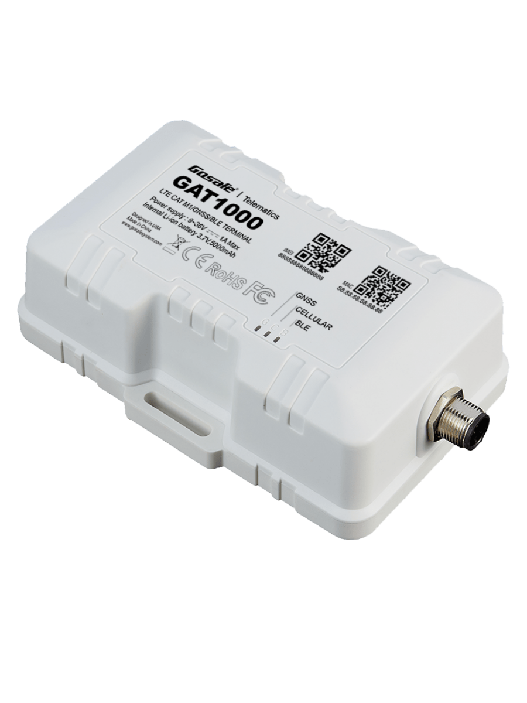

# Gosafe - GAT1000

The GAT1000 Asset Tracker from Gosafe is a rugged GPS tracking device built for heavy equipment, trailers and other high value outdoor assets. It combines wideband LTE Cat 1 connectivity with a sensitive 56 channel multi GNSS receiver to provide reliable real time location and telemetry. Designed for harsh environments, the device includes an IP67 water resistant enclosure, a large internal backup battery and flexible I O to support common telematics inputs and outputs.

As a Plaspy compatible tracker, the GAT1000 can feed location fixes, I O events and sensor readings into the Plaspy platform to enable fleet visibility, alerts and reporting. Integrating this tracker with Plaspy helps teams monitor assets in real time, respond to theft or misuse, and consolidate telemetry for operational oversight and historical analysis.

## Key Highlights

- Plaspy compatible asset tracker engineered for heavy equipment trailers and high value outdoor assets.
- LTE Cat 1 wideband connectivity combined with a 56 channel multi GNSS engine for reliable real time tracking.
- Rugged IP67 water resistant enclosure and shock resistant design suitable for outdoor and industrial deployments.
- Internal 5000 mAh backup battery to maintain tracking during primary power interruptions.
- Flexible I O for ignition sensing digital inputs analog inputs and open collector outputs to support telemetry and control.
- BLE support for wireless sensors to extend monitoring to temperature humidity or door status when needed.

## How It Works with Plaspy

When connected to Plaspy the GAT1000 transmits GNSS fixes, I O state changes and sensor measurements so the platform can present live asset positions, alerts and historical journeys. Plaspy ingests the device data to power dashboards, notifications and fleet level reports that support operational decisions and security workflows.

- Real time location and telemetry updates for persistent visibility across fleets and dispersed assets.
- I O events such as ignition sense and digital inputs report on vehicle on off status and door or alarm conditions to Plaspy.
- Analog inputs and fuel monitoring data feed into Plaspy to support fuel level reporting and anomaly detection.
- Open collector outputs can be used with external relays and Plaspy rules to support remote immobilization and control workflows.
- BLE sensor readings allow Plaspy to include temperature humidity or other wireless sensor data in dashboards and alerts.

## Typical Use Cases

- Fleet management for heavy equipment and trailers monitoring location utilization and operating status.
- Asset anti theft and recovery workflows with real time tracking and remote relay control.
- Fuel monitoring and telemetry to detect consumption anomalies and support maintenance planning.
- Cold chain or environmental monitoring using BLE sensors for temperature and humidity tracking.
- Protection of high value outdoor assets where rugged enclosure and backup power are required.

## Why Choose This Tracker with Plaspy

The GAT1000 is well suited to organizations that need a durable, full featured tracker that can be integrated into a fleet management platform like Plaspy. Its combination of wideband cellular connectivity, a sensitive multi GNSS receiver and industrial I O makes it practical for mixed fleets, trailers and stationary assets that require accurate location intelligence and telemetry.

Paired with Plaspy the GAT1000 delivers consolidated visibility, configurable alerts and fleet level reporting that support security, utilization and maintenance workflows. To learn more about Plaspy and platform capabilities visit https://www.plaspy.com. Product specifications, availability and manufacturer details can change over time so please verify current specifications on the official Gosafe site https://gosafesystem.com/ before making deployment decisions.
