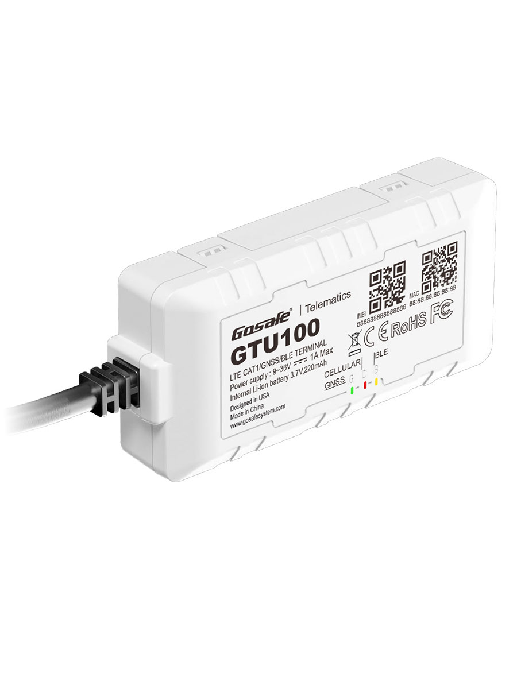

# Gosafe - GTU100

The GTU100 is a compact, high-performance GPS tracker engineered for light and commercial fleet management and optimized for Plaspy-compatible deployments. Built to deliver reliable, real-time tracking and rich telemetry, the GTU100 supports LTE Cat-1 with 2G/3G fallback and dual-SIM/eSIM options to ensure continuous connectivity worldwide. Its multi-GNSS receiver, low-power architecture and extensive I/O make it an ideal GPS tracker for fleet operators who require consistent location updates, crash detection and integrated sensor telemetry.

Designed for rapid integration with Plaspy, the GTU100 combines onboard event processing \(Gosafe Event Manager\), device management \(GICUS\) and OTA firmware updates to simplify rollouts and ongoing fleet operations. Whether you need real-time tracking, driver behaviour telemetry, anti-theft measures or Bluetooth sensors for temperature and asset monitoring, the GTU100 delivers a vehicle-ready package that scales across mixed fleets.

## Key Highlights

- Plaspy compatible GPS tracker with LTE Cat-1 connectivity and 2G/3G fallback for resilient, worldwide communications.
- High-sensitivity multi-GNSS receiver \(GPS/GLONASS/Galileo/BeiDou\) with SBAS accuracy down to 2.0 m in open sky and -167 dBm tracking sensitivity.
- Low-power operating modes \(400 µA deep sleep\) and an onboard 220 mAh backup battery for uninterrupted telemetry and crash reporting.
- Multiple configurable I/O: ignition sense, digital input \(0–30 VDC\), open-collector digital output \(150 mA\) and 1-Wire for driver ID/temperature sensors.
- BLE 4.2 for Bluetooth sensors and wireless peripherals, plus Wi‑Fi assisted location for improved positioning in built-up or indoor-edge scenarios.
- Robust vehicle fit: wide input voltage \(9–40 VDC\) for 12V and 24V systems, compact form factor, IPX5 resistance and extended temperature ratings for demanding environments.
- Turnkey remote management and event processing with GEM and GICUS, supporting TCP/UDP/SMS data delivery and OTA firmware updates for fleet-scale operations.

## How It Works with Plaspy

When deployed with Plaspy, the GTU100 becomes a full-featured telemetry node that streams location, motion and sensor data into the Plaspy platform for real-time tracking, alerts and historical reporting. Data is transmitted over cellular \(TCP/UDP/SMS\) to Plaspy endpoints and processed locally by GEM for event-driven workflows such as crash capture, ignition events and driver ID logging.

- Real-time location and telemetry updates: multi-GNSS positions, assisted GPS and Wi‑Fi-aided fixes feed Plaspy for accurate tracking.
- Ignition and driver events: ignition sense and 1-Wire driver ID enable Plaspy to correlate trips, runtimes and driver behaviour.
- Crash and motion detection: built-in 3D accelerometer captures impact events and motion status for immediate Plaspy alerts and crash reporting.
- Remote control and anti-theft support: the open-collector output can be used with external relay modules to enable immobilizer workflows and remote disable through Plaspy when required.
- Bluetooth sensors: BLE 4.2 connects temperature, door or cargo sensors; Plaspy ingests sensor telemetry for refrigerated fleet monitoring or asset condition tracking.

## Technical Overview

| Connectivity | LTE Cat-1 with 2G/3G fallback; dual-SIM support and embedded eSIM option; data over TCP/UDP/SMS |
| --- | --- |
| Bands | LTE Cat-1 bands covering a broad global footprint \(variants by region/carrier\) |
| Data Rates | Up to 5 Mbps uplink and 10 Mbps downlink \(LTE Cat-1\) |
| Power & Battery | Input 9–40 VDC \(12V / 24V systems\), onboard 220 mAh Li-ion backup battery; power modes: 400 µA deep sleep, 3 mA sleep, 60 mA power save, 120 mA active tracking |
| Interfaces | Ignition sense; one high/low digital input \(0–30 VDC\); one open-collector digital output \(150 mA\); 1-Wire interface; 8-wire pigtail connector; micro USB for config/debug; SIM access for 4FF and on‑board eSIM |
| GNSS | Multi‑GNSS: GPS / GLONASS / Galileo / BeiDou; SBAS accuracy down to 2.0 m \(open sky\); -167 dBm tracking sensitivity; assist GPS and concurrent GNSS reception |
| Bluetooth | BLE 4.2 for connection to wireless sensors and beacons |
| Sensors | Built-in 3D accelerometer for motion and impact detection; crash data capture supported |
| Remote Management | Gosafe Event Manager \(GEM\) for event processing; GICUS device management; OTA firmware updates |
| Form Factor & Environment | 92 × 45 × 19.5 mm; 85 g; IPX5 water resistance; operating temp: -40 to +85 °C \(without backup battery\), -10 to +60 °C \(with backup battery\) |
| Certifications & Accessories | CE and E‑Mark certified; FCC in process. Accessories: magnetic/harness mounts, temperature sensors, RFID/iButton kits, external relay modules |

## Use Cases

- Fleet management: real-time tracking of light and commercial vehicles with driver ID, trip logging and telemetry for operational efficiency.
- Anti-theft & immobilization: remote disable workflows using the digital output + external relay modules integrated with Plaspy alerts.
- Crash reporting and driver behaviour: 3D accelerometer and crash capture data enable collision alerts and post‑event analysis in Plaspy.
- Sensorized asset monitoring: Bluetooth sensors and 1-Wire temperature probes for refrigerated transport, cargo condition monitoring and asset sensors.
- Mixed-fleet global deployments: LTE Cat-1 with fallback and eSIM options provide dependable connectivity across regional networks for remote telemetry.

## Why Choose This Tracker with Plaspy

The GTU100 pairs technical robustness with practical fleet features to deliver reliable Plaspy-compatible tracking at scale. Its multi-GNSS accuracy, low-power modes and dual-SIM/eSIM connectivity reduce downtime and improve fix availability in challenging environments. Combined with GEM event processing and GICUS remote management, the GTU100 makes real-time tracking, telemetry and maintenance simpler to operate and maintain across large fleets. For operators seeking to add anti-theft controls, crash reporting and Bluetooth sensor integration to Plaspy, the GTU100 provides a compact, vehicle-ready solution that supports fast deployments and long-term manageability.

