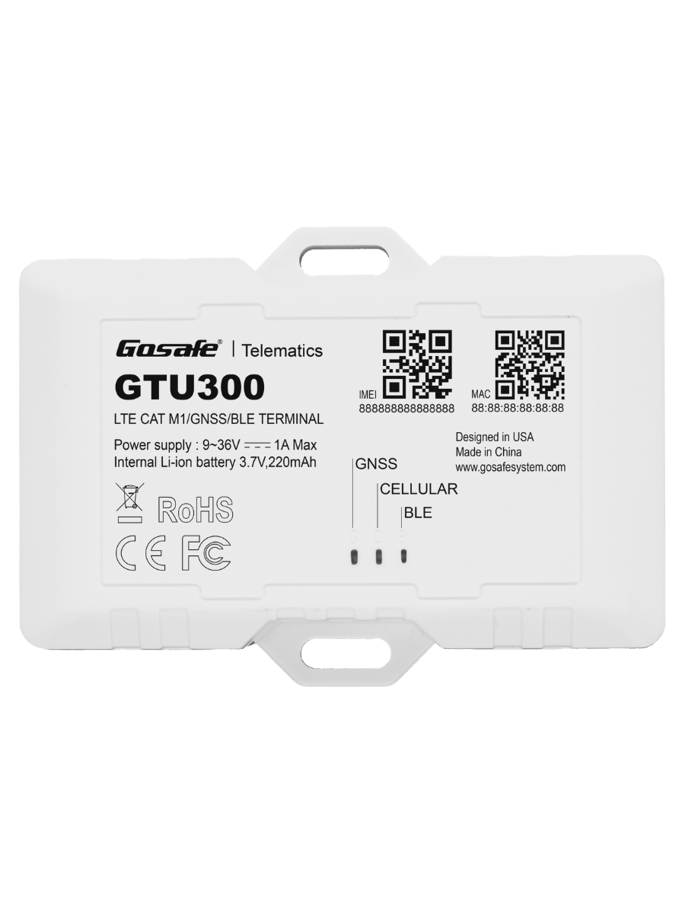

# Gosafe - GTU300

The GTU300 is a compact telematics device from Gosafe designed for professional fleet management, stolen vehicle recovery and usage based insurance deployments. It combines multi GNSS positioning with multiple connectivity fallbacks, on board backup power and a range of vehicle I O options to deliver continuous location and event reporting across cars, trucks and rental fleets.

As a Plaspy compatible tracker, the GTU300 can stream its location and vehicle telemetry into Plaspy for live tracking, alerts and reporting. Its combination of reliable connectivity options, flexible inputs and accessory support makes it a practical choice for fleets and operations teams that require actionable insights from Plaspy without sacrificing installation flexibility.

## Key Highlights

- Plaspy compatible for seamless real time tracking and fleet management integration
- Global LTE Cat 1 connectivity with GPRS fallback and multiple transport options for resilient communications
- Multi GNSS positioning with Wi Fi fallback for improved location reliability in mixed environments
- BLE 4.2 support for integration with wireless sensors and accessory pairing
- Comprehensive I O and serial interfaces including ignition sense, configurable digital inputs and outputs, and serial connectivity for external sensors
- Vehicle grade power design with wide voltage support and an internal backup battery to maintain reporting during power events
- OTA firmware update support and compatibility with device management platforms for scalable maintenance

## How It Works with Plaspy

When paired with Plaspy, the GTU300 delivers continuous location updates and vehicle telemetry to Plaspy dashboards and reporting tools. Plaspy consumes positional data, input and event signals, and accessory sensor readings to provide fleet visibility, alerts and historical analysis that support operational decisions.

- Real time location streaming with GNSS and Wi Fi fallback visibility in Plaspy
- Event driven alerts such as ignition on off, tamper or input triggered alarms routed to Plaspy notifications
- Trip histories and geofencing for route auditing and operational oversight
- Sensor data ingestion from serial and 1 Wire interfaces for fuel and other telemetry reporting
- BLE sensor and beacon support for temperature, door and proximity monitoring within Plaspy

## Typical Use Cases

- Fleet anti theft and stolen vehicle recovery with live location and relay based immobilizer control
- Fleet management and optimization including trip logging and ignition based monitoring
- Fuel monitoring and vehicle finance scenarios using external sensor integrations
- Rental and carsharing services with BLE enabled check in check out and audit trails
- Condition monitoring for temperature sensitive assets using BLE sensors and accelerometer event detection

## Why Choose This Tracker with Plaspy

The GTU300 pairs robust connectivity and flexible I O with compact hardware suitable for diverse vehicle types, making it a strong candidate for organizations using Plaspy for fleet operations. Its fallbacks and dual SIM eSIM capability help maintain uptime across regions, while multi GNSS and Wi Fi fallback increase positional reliability for real time monitoring and reporting inside Plaspy.

Operational features such as OTA updates and support for established device management platforms simplify maintenance at scale and reduce field visits. For teams that need a balance of location accuracy, peripheral integration and remote manageability, combining the GTU300 with Plaspy provides a practical telematics solution that supports theft recovery, usage based programs and fleet performance initiatives.

To learn more about Plaspy and how compatible devices like the GTU300 integrate with the platform visit https://www.plaspy.com. Product specifications and availability can change over time, so for the most current technical details please verify with the manufacturer documentation at https://gosafesystem.com/
