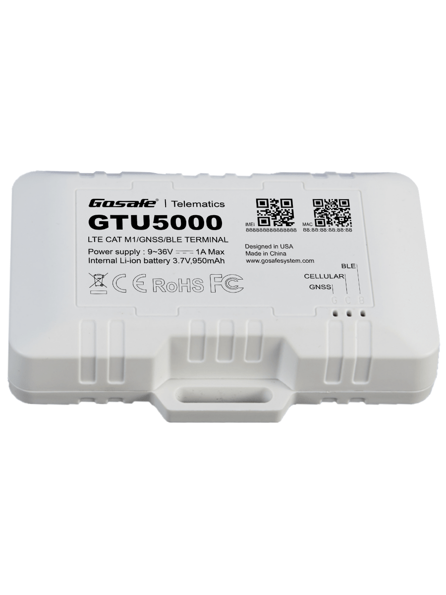

# Gosafe - GTU5000

The GTU5000 is a professional grade GPS tracker designed for fleet operators and telematics integrators who need robust hardware for real time tracking and advanced telemetry. Engineered for common vehicle electrical systems, the device combines cellular connectivity with multi constellation GNSS and a range of inputs and outputs to capture location, sensor and driving status information suitable for fleet and asset monitoring.

As a Plaspy compatible device, the GTU5000 can send position, sensor and status data into Plaspy for centralized monitoring, alerts and reporting. Its design for scalable deployments, fallback connectivity and remote management capabilities make it a practical choice when integrating hardware with Plaspy for fleet tracking, anti theft workflows and operational visibility.

## Key Highlights

- Confirmed Plaspy compatible GPS tracker offering cellular connectivity with fallback for reliable real time tracking.
- Multi constellation GNSS for higher positioning accuracy and frequent update rates suitable for route reporting.
- Wide range of configurable inputs and outputs to capture ignition and sensor signals and to control relays or immobilizers.
- BLE and support for external sensor interfaces to extend telemetry for temperature, driver ID and other asset data.
- Internal backup battery and configurable power modes to maintain reporting during power interruptions.
- Remote firmware updates and device management support for scaled deployments and ongoing maintenance.
- Rugged design intended for commercial vehicles and mobile assets in demanding environments.

## How It Works with Plaspy

When paired with Plaspy, the GTU5000 streams position, sensor and status information so fleet managers get continuous visibility through Plaspy dashboards, live maps, alerts and reports. Plaspy ingests the device telemetry to produce operational insights and to support workflows such as anti theft response and maintenance planning.

- Continuous location and telemetry delivered to Plaspy for live tracking and historical route replay.
- Vehicle status and ignition detection reported to Plaspy to drive run time metrics and utilization reporting.
- Sensor data such as fuel level or temperature forwarded to Plaspy to support alerts and compliance checks.
- Outputs and relay controls accessible from Plaspy workflows to support remote immobilization and anti theft actions.
- Bluetooth and 1 Wire sensor data integrated into Plaspy for driver ID, cargo monitoring and environmental logging.

## Typical Use Cases

- Fleet management for real time vehicle tracking, utilization analytics and route history.
- Anti theft monitoring with tamper alerts and remote immobilizer control managed through Plaspy.
- Driver behavior and safety programs that combine GNSS updates with on device sensor events for coaching.
- Temperature and cargo monitoring using external sensors for refrigerated loads or sensitive freight.
- Heavy equipment and asset telemetry where rugged hardware and multiple interfaces support diverse sensor types.

## Why Choose This Tracker with Plaspy

The GTU5000 is well suited to organizations that need a durable telematics device with flexible sensor integration and remote management capabilities. Its combination of reliable cellular connectivity, multi GNSS positioning and broad I O support makes it a practical foundation for feeding vehicle and asset data into Plaspy for centralized oversight.

For fleets and integrators seeking end to end visibility, the GTU5000 provides the hardware features commonly required to implement location tracking, anti theft controls and sensor driven alerts in Plaspy without adding unnecessary complexity. Its OTA update and management options help maintain devices at scale and simplify lifecycle operations.

Learn more about using Plaspy with compatible GPS trackers on https://www.plaspy.com. Product specifications and availability can change over time, so verify the latest technical details and manufacturer guidance on the official Gosafe site at https://gosafesystem.com/
