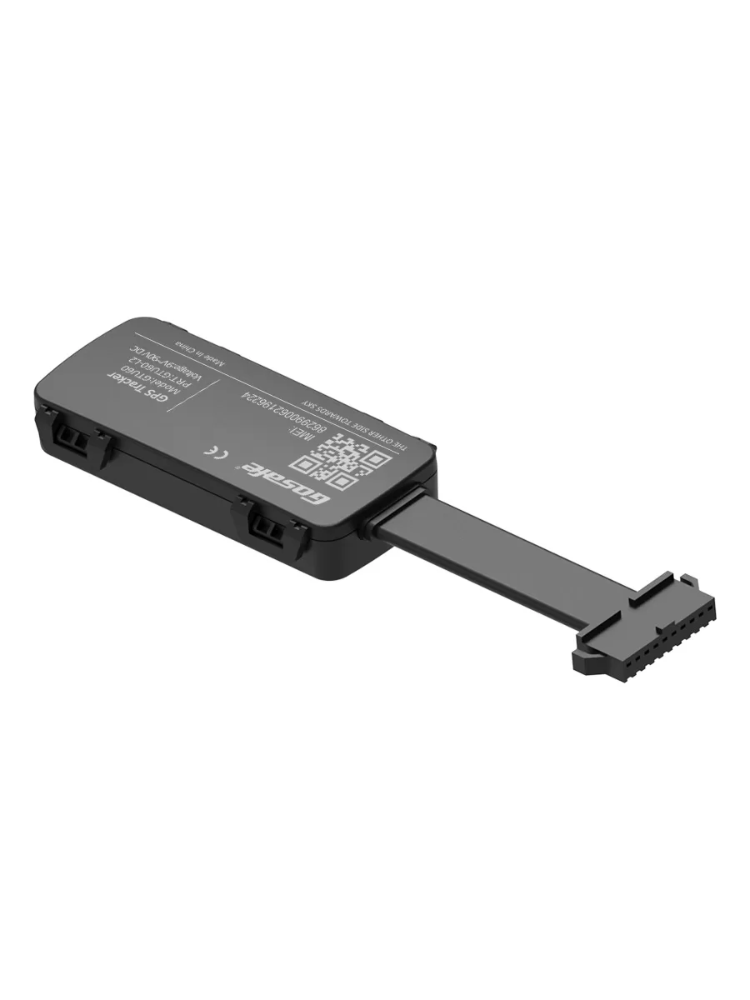

# Gosafe - GTU60

The GTU60 is an economical, full featured GPS tracker from a proven OEM designed for fast installation and dependable operation in vehicle fleets. It combines multi band cellular connectivity with a high sensitivity 32 channel GNSS receiver and AGPS to provide consistent real time location and telemetry. The unit is compact and tamper resistant, with internal antennas and an IP65 water resistant enclosure for discreet installations across light commercial and rental vehicle deployments.

As a Plaspy compatible device, the GTU60 transmits position, motion events and I O status into Plaspy for live monitoring and historical reporting. Its feature set aligns with common fleet and anti theft workflows supported by Plaspy, including ignition reporting, crash event detection and remote immobilization control when used with relay accessories. This makes the GTU60 a practical choice for operators who want reliable tracking data fed into Plaspy for operational oversight.

## Key Highlights

- Economical, full featured tracker designed for fleet and rental applications and stolen vehicle recovery.
- Multi band cellular connectivity with fallback options for consistent data delivery to Plaspy.
- High sensitivity 32 channel GNSS receiver with AGPS for improved position acquisition and consistent tracking.
- Compact, tamper resistant IP65 enclosure with internal SIM and antennas for discreet mounting.
- Built for vehicle power ranges with a wide input voltage window and a small onboard rechargeable backup battery.
- Onboard crash capable 3D accelerometer and ignition sense for event detection and runtime reporting.
- Low power design to reduce parasitic drain and support longer vehicle uptime between maintenance.

## How It Works with Plaspy

When paired with Plaspy, the GTU60 sends location, motion events and I O status to the platform so fleet managers can monitor vehicles in real time, route alerts, and produce historical reports. Plaspy ingests the device telemetry and exposes it through maps, notifications and reporting tools that support operational decision making and loss prevention.

- Real time location and telemetry updates delivered to Plaspy for live maps and status dashboards.
- Ignition sense reported to Plaspy to support runtime tracking, unauthorized start alerts and usage reports.
- Crash detection and impact logging relayed into Plaspy for rapid incident notifications and post event analysis.
- Remote immobilizer workflows enabled via the device digital output and relay accessories, controllable through Plaspy setups.
- Geofence alerts, trip reports and historical tracking available in Plaspy using the device position stream.
- Sensor inputs and serial or 1 wire integrations can be mapped into Plaspy for extended telemetry like fuel or temperature where supported.

## Typical Use Cases

- Light commercial fleet tracking for delivery, service, and work vehicles requiring reliable location and runtime reporting.
- Rental and buy here pay here operations that need geofence enforcement, usage monitoring and unauthorized use alerts.
- Stolen vehicle recovery and anti theft deployments using discreet installation, internal antennas and remote immobilization options.
- Accident and incident reporting where accelerometer based crash events trigger alerts and logging in Plaspy.
- Telemetry expansion with aftermarket sensors to capture fuel, temperature or driver ID and surface that data in Plaspy dashboards.

## Why Choose This Tracker with Plaspy

The GTU60 is a practical choice for organizations that need a cost effective, vehicle focused tracker feeding data into Plaspy. Its combination of reliable GNSS reception, multi band cellular connectivity, ignition sensing and crash capable accelerometry covers the core requirements for fleet monitoring, anti theft workflows and rental oversight. The compact, tamper resistant form factor with internal SIM and antennas helps maintain a discreet installation that supports recovery and security use cases.

When integrated into Plaspy, the GTU60 supports the platform capabilities fleet operators rely on most: live visibility, automated alerts, trip and runtime reporting, and options for remote immobilization through accessory relays. For fleets and rental operators seeking an economical tracker that addresses essential tracking and anti theft needs while delivering data into Plaspy, the GTU60 is a solid, practical option.

Learn more about how Plaspy can use compatible trackers like the GTU60 on the Plaspy website https://www.plaspy.com. Product specifications and manufacturer details can change over time, so please verify current technical specifications and availability on the Gosafe official website https://gosafesystem.com/.
